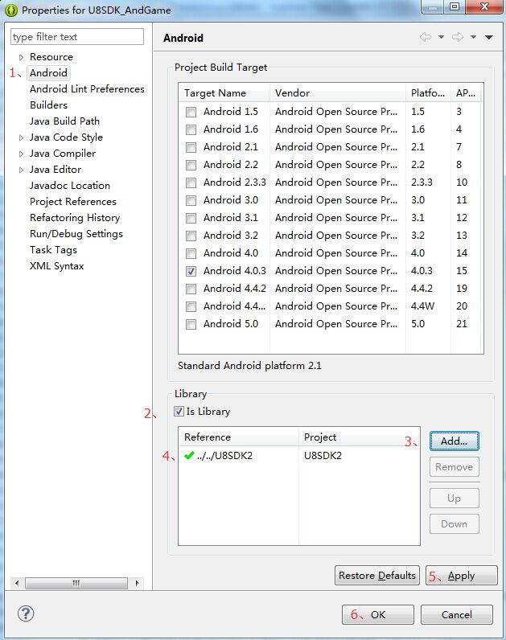
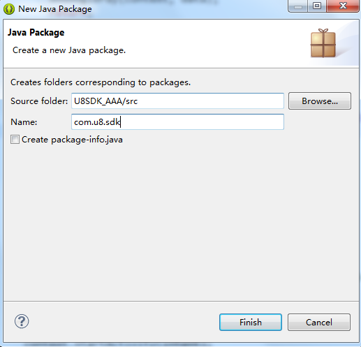

接入新渠道
===========

NOTE:在U8SDK框架基础上接入一个新渠道SDK，首先，心里请明确一点。接入过程和游戏工程没有半点联系，也就是说，游戏开发和SDK接入是完全解耦的。所以，接入的时候，不要想着游戏中怎样怎样，严格按照下面的步骤进行接入即可。
所有接入工程就是[库工程]；库工程在编译之后，会在该工程的bin目录下生成一个jar包。


接入准备
-------

**1、导入U8SDK2抽象层框架工程**

U8SDK2为eclipse工程结构，如果你使用的是eclipse或者adt bundle，那么直接导入到工程中即可。关于如何导入一个现有的Android工程，可以参考这里：

[导入Android工程](http://jingyan.baidu.com/article/a65957f4983d9e24e77f9b70.html)

如果你使用的是AndroidStudio，那么可以参考这里：

[导入Android工程到AS](http://jingyan.baidu.com/article/b87fe19e9e209f5218356808.html)

**2、新建一个Android工程**

NOTE:每个渠道SDK都有一个独立的接入工程，建议所有的接入工程都放在同一个目录下，方便管理，命名格式最好也统一。比如U8SDK中，所有的接入工程都放在U8SDK\_Projects目录下，每个接入工程的命名规则为:U8SDK\_渠道名称;比如，我们现在需要接入AAA渠道，我们新建一个U8SDK\_AAA工程。

关于如何新建一个Android工程，可以参考这里：

[如何新建Android工程](http://jingyan.baidu.com/article/e5c39bf5b9b0e139d6603346.html)

如果你使用的是AndroidStudio，那么可以参考这里：

[如何新建Android工程](http://jingyan.baidu.com/article/a65957f4f1b4c724e67f9bc9.html)

为了能够在上面新建的接入工程中使用U8SDK2工程中的类以及方法，我们需要在这个工程中引用U8SDK2工程。

关于如何引用一个Android工程，可以参考这里：

[如何引用Android工程](http://www.2cto.com/kf/201407/313718.html)

如果你使用的是AndroidStudio，那么可以参考这里：

[如何引用Android工程](http://blog.csdn.net/fancylovejava/article/details/46726651)

U8SDK中所有的接入工程都是[库工程]。我们后面都以eclipse中为例，工程右键->Properties，打开属性面板，如下设置：



其中，第3步Add之后，选择之前导入的U8SDK2工程。

**3、添加渠道SDK需要依赖的jar包**

NOTE:一般渠道都会提供两个工程，一个Demo工程和一个库工程。虽然他文档上有说让我们导入库工程，然后引用他。但是我们不必这么做。我们直接将库工程中libs下，所有的jar包[Ctrl+C]一下，然后回到eclipse界面，将接入工程的libs选中，然后[Ctrl+V]拷贝过来，即可。库工程其他所有目录下的东西，都不需要拷贝到接入工程中。

直接去渠道SDK提供的库工程中，或者找到他所有的jar包，拷贝到eclipse中我们的接入工程的libs目录下。有些版本中，拷贝的时候，自动添加引用，可以在代码中使用。如果发现在代码中，无法找到SDK对应的类，那么可能需要手动添加一下引用。

工程右键->Properties，打开工程属性面板，如下设置：


其中，第2步，点开添加之后，找到当前接入工程，点开到libs目录，然后全选里面的jar包即可。

这样，你再在代码中调用对应的类和方法，就应该可以找到了。

**4、新建一个包名**

在工程中src目录上右键->New->Package，新建一个包名，建议每个渠道接入工程中，包名都一样，或者规则一样。U8SDK中所有接入工程的包名都是com.u8.sdk




实现渠道SDK必须接入的方法
-------

NOTE:所有渠道SDK需要接入的方法，都大同小异。我们将其归为三大类：
1、初始化：	 大部分渠道都有初始化方法，有的需要在Activity的onCreate中调用;有的则需要在Application的onCreate中调用
2、用户相关：包含[登录]、[切换帐号]、[登出]、[个人中心]、[提交玩家数据]、[退出确认框]
3、支付：仅仅包含一个充值的接口

在U8SDK中，我们将所有需要实现的渠道SDK的接口，都封装在一个单例类中。所以，比如这里，我们U8SDK_AAA接入工程，我们定义一个AAASDK这样一个单例类，在这个单例类中，实现所有渠道SDK要求的方法。这些方法包含上面三大类中所有的方法：

```
package com.u8.sdk;

public class AAASDK {

	private static AAASDK instance;
	
	private String appID;
	private String appKey;
	
	private AAASDK(){
		
	}
	
	public static AAASDK getInstance(){
		if(instance == null){
			instance = new AAASDK();
		}
		return instance;
	}
	
	
	public void initSDK(SDKParams params){
		this.parseSDKParams(params);
		this.initSDK();
	}
	
	private void initSDK(){
		//TODO::这里调用AAA的SDK初始化方法
	}
	
	private void parseSDKParams(SDKParams params){
		
		this.appID = params.getString("AAA_APPID");
		this.appKey = params.getString("AAA_APPKEY");
	}
	
	public void login(){
		//TODO::这里调用AAA的登录方法
	}
	
	public void switchLogin(){
		//TODO::这里调用AAA切换帐号的方法
		//如果没有提供切换帐号的方法，那么切换帐号的逻辑就是[先登出，再登录]，也就是先调用logout，再调用login
	}
	
	public void logout(){
		//TODO::调用AAA的登出方法
	}
	
	public void showUserCenter(){
		//TODO::调用AAA显示个人中心的方法
		//如果AAA没有提供对应的接口，则不用实现该方法
	}
	
	public void exit(){
		//TODO::调用AAA显示退出确认框接口
		//如果AAA没有提供对应的接口，则不用实现该方法
	}
	
	public void submitGameData(UserExtraData data){
		//TODO::调用AAA上报玩家数据接口
		//如果AAA没有提供对应的接口，则不用实现该方法
	}
	
	public void pay(PayParams data){
		//TODO::调用AAA充值接口
	}
}


```

具体的接入，可以你的U8SDK目录中U8SDK_Projects目录下的已经接好的渠道SDK工程。

触发U8SDK事件
-------

NOTE:接入工程中，在初始化成功，失败；登录成功，失败；切换帐号成功，失败；登出成功，失败；支付成功，失败 等时刻，都需要往抽象层抛出对应的事件，以便抽象层中能够分发这些事件，这样游戏接入工程监听这些事件，就能做对应的逻辑处理。

```
1、普通事件

所有的错误或者失败时，都可以通过调用U8SDK.getInstance().onResult()方法抛出对应的事件。比如：
   
   初始化成功：U8SDK.getInstance().onResult(U8Code.CODE_INIT_SUCCESS, "init success");
   初始化失败：U8SDK.getInstance().onResult(U8Code.CODE_INIT_FAIL, "init failed");
   登录失败：U8SDK.getInstance().onResult(U8Code.CODE_LOGIN_FAIL, "login failed.resultCode:"+resultCode);
   ......

所有事件类型都在U8Code中定义的常量。

一般对于无关紧要的事件，也就是不需要游戏中做特殊处理，或者不需要传递很多参数的事件，我们都采用这种方式。

2、登录成功事件

SDK登录成功时，需要调用U8SDK.getInstance().onLoginResult(String ext)方法，抛出登录成功事件。

SDK登出成功之后，一般会返回一些用户信息和token或者session之类的，用于登录认证的凭据。我们需要将登录认证需要的参数传给U8Server进行二次认证。但是二次认证是统一在抽象层做的。

这里我们直接将登录认证需要的参数，通过ext参数传到抽象层中即可。

如果含有多个参数，可以采用json格式；如果只有一个参数，直接传这个参数即可。或者你也可以采用其他的格式，只要U8Server那边也根据同样的格式进行解析。

3、切换帐号成功事件

SDK切换帐号成功的事件，有可能有两种情况，一个是仅仅登出当前登录用户，弹出登录框；一个是切换帐号并且已经登录了另一个帐号。

对于第一个情况，我们调用U8SDK.getInstance().onSwitchAccount()

游戏中监听对应的事件时，收到onSwitchAccount时，需要返回游戏的登录界面，并显示SDK的登录界面

对于第二个情况，我们调用U8SDK.getInstance().onSwitchAccount(String ext)接口。里面的参数格式和登录成功一致

游戏中监听对应的事件时，收到该事件时，需要返回游戏的登录界面，并直接将用户信息显示一下，无需弹出SDK登录界面

4、登出成功事件

SDK登出成功之后，或者用户在SDK个人中心界面中点击登出时，我们需要抛出一个U8SDK.getInstance().onLogout()事件。

游戏中监听对应的事件时，收到onLogout时，需要返回游戏的登录界面让用户重新登录

5、支付成功

因为网游一般支付都是异步通知到游戏服务器的，SDK返回的支付成功，并不能代表玩家真的拿到游戏币了。所以，客户端SDK返回的支付成功事件，我们一般不需要做特殊的逻辑处理。

所以支付成功，我们依然使用onResult接口，抛出一个支付成功的事件即可。

U8SDK.getInstance().onResult(U8Code.CODE_PAY_SUCCESS, "pay success");

```

实现IUser接口
-------

NOTE:所有插件的实现类，都必须包含一个构造函数，这个构造函数，必须含有一个Activity类型的参数。

为了实现用户相关的功能，我们需要实现IUser接口，实现IUser中定义的一些接口。根据当前SDK支持的方法，在对应的接口中，调用之前我们定义的单例类中封装的方法。

其中isSupportMethod方法，必须实现。返回当前渠道SDK支持的接口。

同时，如果SDK仅仅要求在Activity的onCreate中初始化SDK，那么直接在IUser的实现类的构造函数中调用初始化方法即可。

```
package com.u8.sdk;

import com.u8.sdk.utils.Arrays;

import android.app.Activity;

public class AAAUser implements IUser {

	private String[] supportedMethods = {"login","switchLogin","logout","exit"};
	
	/**
	 * 必须定义包含一个Activity参数的构造函数，否则实例化的时候，会失败
	 * 
	 * 一般SDK初始化方法的调用也在这里调用。除非SDK要求要在Application对应的方法调用。
	 * @param context
	 */
	public AAAUser(Activity context){
		AAASDK.getInstance().initSDK(U8SDK.getInstance().getSDKParams());
	}
	
	/**
	 * 判断当前插件是否支持接口中定义的方法
	 */
	@Override
	public boolean isSupportMethod(String methodName) {

		return Arrays.contain(supportedMethods, methodName);
	}

	/**
	 * 打开SDK登录界面
	 */
	@Override
	public void login() {
		AAASDK.getInstance().login();
	}

	/**
	 * 这个方法暂时弃用
	 */
	@Override
	public void loginCustom(String customData) {
	}

	@Override
	public void switchLogin() {
		AAASDK.getInstance().switchLogin();
	}

	@Override
	public boolean showAccountCenter() {
		return false;
	}

	@Override
	public void logout() {
		AAASDK.getInstance().logout();
	}

	@Override
	public void submitExtraData(UserExtraData extraData) {
	}

	@Override
	public void exit() {
		AAASDK.getInstance().exit();
	}

	@Override
	public void realNameRegister() {
	}

	@Override
	public void queryAntiAddiction() {
	}

}

```

实现IPay接口
-------

NOTE:所有插件的实现类，都必须包含一个构造函数，这个构造函数，必须含有一个Activity类型的参数。

为了实现支付的功能，我们需要实现IPay接口，实现IPay中定义的接口。根据当前SDK支持的方法，在对应的接口中，调用之前我们定义的单例类中封装的方法。

其中isSupportMethod方法，直接返回true即可。因为该插件只有一个pay方法。

```
package com.u8.sdk;

import android.app.Activity;

public class AAAPay implements IPay {

	public AAAPay(Activity context){
		
	}
	
	@Override
	public boolean isSupportMethod(String methodName) {
		return true;
	}

	/**
	 * 打开SDK支付界面
	 */
	@Override
	public void pay(PayParams data) {
		AAASDK.getInstance().pay(data);
	}

}

```

配置config.xml
-------


NOTE:每个渠道SDK，都需要一个config.xml配置文件，配置当前渠道SDK的参数信息，插件信息，版本信息等。供打包工具解析使用。config.xml的格式固定

```
<?xml version="1.0" encoding="UTF-8"?>
<config>
    
    <params>
        <param name="AAA_APPID"  required="1" showName="AppID" desc="渠道SDK分配的appID" bWriteInManifest="0" bWriteInClient="1" />
        <param name="AAA_APPKEY"  required="1" showName="AppKey" desc="渠道SDK分配的appKey" bWriteInManifest="0" bWriteInClient="1" /> 
        <param name="AAA_TEST"  required="1" showName="测试" desc="测试写入Manifest.xml" bWriteInManifest="1" bWriteInClient="0" />
        <param name="AAA_TEST2"  required="0" value="1" showName="测试2" desc="测试直接填写value" bWriteInManifest="1" bWriteInClient="0" />
    </params>
    
    <operations>
        <operation step="1" type="mergeManifest" from="SDKManifest.xml" to="AndroidManifest.xml" />
        <operation step="2" type="copyRes" from="assets" to="assets" />
        <operation step="3" type="copyRes" from="libs" to="lib" />
        <operation step="4" type="copyRes" from="res" to="res" />
        <operation step="5" type="copyRes" from="root" to="" />
    </operations>
    
    <plugins>
        <plugin name="com.u8.sdk.BaiduUser" type="1" desc="用户登录接口"/>
        <plugin name="com.u8.sdk.BaiduPay" type="2" desc="用户支付接口"/>
    </plugins>
    
    <version>
        <versionCode>1</versionCode>
        <versionName>3.3.1</versionName>
    </version>    
    
</config>
```

可以看到这个配置文件中，总共分为四块内容：

1、params

```
params中定义了我们需要配置的参数的key，以及参数的一些属性。

1) name:当前参数的key，这个key建议以渠道SDK为前缀，可以避免冲突。
2) required:当前参数是否需要在游戏的渠道配置文件中配置。required="1":需要配置;required="0":不需要配置。注意为0的时候，那么value必须在这里填写。
3) showName:显示的名称(无实际用处)
4) desc:该参数的说明(无实际用处)
5) bWriteInManifest:该参数是否写到AndroidManifest.xml的meta-data中。bWriteInManifest="1":写入;bWriteInManifest="0":不写入
6）bWriteInClient：该参数是否写到assets目录下的developer_config.properties文件中。bWriteInClient="1":写入;bWriteInClient="0":不写入

比如之前，我们在AAASDK的parseSDKParams中解析了两个参数[AAA_APPID]和[AAA_APPKEY]。其对应的配置就在这里。

注意，除了required="0"的参数的value直接配置在这里，说明这个参数的值每个游戏都一样，无需各个游戏都去配置。required="1"的话，这里不用配置value。value是在每个游戏的配置目录下的config.xml中对应该渠道的sdk-params中进行配置的。因为每个游戏的value都不一样。

有些渠道SDK，要求参数在meta-data中，key固定的。那么需要将参数配置在这里，key就是渠道要求的key。同时bWriteInManifest="1"即可。

```

2、operations

```
operations中定义了当前打包工具需要处理的操作。
1) step: 操作步骤
2) type:操作类型。[mergeManifest]:合并manifest.xml；[copyRes]:拷贝资源目录;
3) from:从这个文件或者目录进行合并或者拷贝
4） to: 合并到或者拷贝到这个文件或者目录

```

3、plugins

```
plugins中配置了当前该渠道对应的插件的实现类，也就是我们刚刚实现IUser和IPay两个接口的类

1) name:插件实现类的全类名。注意：必须包含包名的全路径
2) type:对应的插件类型。[1]：用户插件;[2]：支付插件;[3]：推送插件;[4]：分享插件;[5]：分析统计插件;
3) desc:描述（无实际用处）

```

4、version

```
version中配置了当前渠道SDK的版本信息

1) versionCode：自定义的值，需要用到渠道SDK更新机制之后，每次可以增加1
2) versionName: 当前渠道SDK的真实版本

```

配置SDKManifest.xml
-------

NOTE:每个渠道SDK，都需要一个SDKManifest.xml配置文件，在这里配置渠道SDK需要的Activity,Service,Reciever,Provider等组件，以及配置渠道SDK需要的权限信息

```

<?xml version="1.0" encoding="UTF-8"?>
<manifest xmlns:android="http://schemas.android.com/apk/res/android">
    
    <permissionConfig>
        
	    <uses-permission android:name="android.permission.SEND_SMS" />
	    <uses-permission android:name="android.permission.ACCESS_NETWORK_STATE" />
	    <uses-permission android:name="android.permission.ACCESS_WIFI_STATE" />
	    <uses-permission android:name="android.permission.READ_PHONE_STATE" />      
        
    </permissionConfig>
    
    <applicationConfig keyword="com.aaa.login.LoginActivity"
         proxyApplication="com.u8.sdk.AAAProxyApplication">
        
        <!-- 这里一定不要把渠道SDK的Demo中用到的Activity等拷贝进来了 -->
        <activity
            android:name="com.aaa.login.LoginActivity"
            android:configChanges="orientation|navigation|screenSize|keyboard|keyboardHidden"
            android:exported="false"
            android:excludeFromRecents="true"
            android:theme="@style/bdp_dialog_style_fullscreen"/>

	     <!-- other activity,service,provider,reciever... --> 
	       
    </applicationConfig>
    
    
    
</manifest>

```

可以看到这个配置中，只有两大块内容：

1、permissionConfig

```
permissionConfig中配置渠道SDK需要的权限等信息，这些权限信息最终会被合并到最终的AndroidManifest.xml中。注意这里的权限不要重复了。

```

2、applicationConfig

```
applicationConfig中配置渠道SDK中所有配置在application节点中的组件。比如Activity,Serivice,Reciever,Provider等。

1) 这个节点有两个属性。keyword一般直接填写为applicationConfig中第一个组件的name即可。proxyApplication则是U8SDK中处理渠道SDK需要Application继承或者调用对应方法时的解决方案。

关于U8SDK中Application的解决方案可以看这里：[适配Application](http://www.uustory.com/?p=1434)

2) 有些渠道SDK在提供的AndroidManifest.xml中，有一些meta-data，这些meta-data中配置了当前渠道的参数信息。如果这个参数每个游戏都不同，那么需要将这些参数删除，并配置到上面的config.xml的params中，key就是这里meta-data对应的name。同时将bWriteInManifest设置为"1"

3) 一般我们拷贝渠道SDK需要的AndroidManifest.xml中的权限和组件，都是去他们提供的Demo工程的AndroidManifest.xml中拷贝。在拷贝的时候，注意不要将Demo自己定义的Activity等组件拷贝过来了。记得认真过滤一下

```

渠道SDK接入成功之后，我们编译一下，因为我们之前设置了接入工程为库工程，所以在bin目录下，会自动生成一个u8sdk_aaa.jar包。

经过上面的步骤，我们这个AAA渠道SDK的接入工作就结束了。那么，我们怎么将他加入到打包工具中，让我们的母包可以打出该渠道的渠道包呢？

请看下一篇：[渠道SDK在打包工具中的配置](android_package.md)