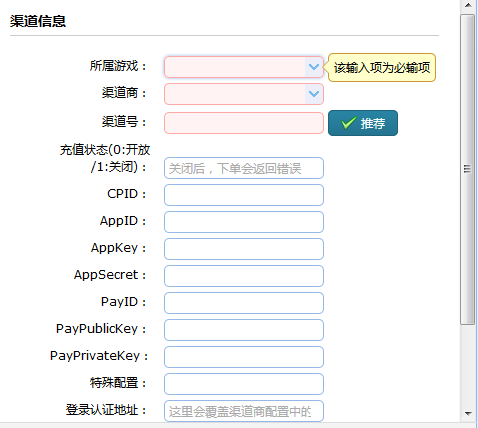

渠道参数配置要点
===========

NOTE:使用U8SDK框架进行渠道SDK的接入和打包，各个渠道SDK的参数分别配置在客户端(打包工具)和服务器(U8Server后台管理)， 客户端的参数，配置在打包工具/games/当前游戏/config.xml中各个channel节点的sdk-params中；服务器端(U8Server)的参数，通过后台管理-》渠道管理，配置在当前游戏对应的当前渠道中，渠道数据中，我们提供了几个预设字段来配置参数，这些参数不外乎用于该渠道的登录认证和支付回调验证签名。




```
渠道对应代码中数据类是com.u8.server.data.UChannel

1、所属游戏：当前渠道属于哪个游戏(代码中通过UChannel的getGame来获取)
2、渠道商：当前渠道属于哪个渠道商(代码中通过UChannel的getMaster来获取)
3、渠道号：每个渠道都必须设置一个唯一的渠道号，可以点击后面推荐来生成一个唯一的渠道号。这个渠道号，和客户端打包工具/games/当前游戏/config.xml中当前渠道channel节点的id属性的值保持一致(代码中通过UChannel的getChannelID来获取)
4、充值状态：是否可以充值，默认是0，可以充值；如果要关闭充值，可以将充值状态设置为1(代码中可以通过UChannel的isPayOpen来判定)
5、CPID：渠道参数预设字段1，字面含义是，渠道分配给该游戏的厂商ID(代码中可以通过UChannel的getCpID来获取)
6、AppID：渠道参数预设字段2，字面含义是，渠道分配给该游戏的游戏ID(代码中可以通过UChannel的getCpAppID来获取)
7、AppKey：渠道参数预设字段3，字面含义是，渠道分配给该游戏的AppKey(代码中可以通过UChannel的getCpAppKey来获取)
8、AppSecret:渠道参数预设字段4，字面含义是，渠道分配给该游戏的AppSecret(代码中可以通过UChannel的getCpAppSecret来获取)
9、PayID:渠道参数预设字段5，字面含义是，渠道分配给该游戏的支付ID(代码中可以通过UChannel的getCpPayID来获取)
10、PayPublicKey:渠道参数预设字段6，字面含义是，渠道分配给该游戏的公钥(代码中可以通过UChannel的getCpPayKey来获取)
11、PayPrivateKey:渠道参数预设字段7，字面含义是，渠道分配给该游戏的密钥(代码中可以通过UChannel的getCpPayPriKey来获取)
12、特殊配置：渠道参数预设字段8，部分渠道特殊需求的参数配置字段(代码中可以通过UChannel的getCpConfig来获取)
13、后面几个字段，和渠道商中相同，如果设置了，会覆盖渠道商中的配置。仅仅在渠道有特殊需求时才需要配置来覆盖渠道商通用配置
```

NOTE:UChannel中预设了8个字段来配置渠道参数。 每个渠道的参数配置在哪个字段，是根据代码该渠道登录认证和支付回调读取的是哪个字段，来决定参数配置在哪些字段中.
下面就当前U8Server当前支持的所有渠道的参数配置在哪些预设字段中进行一个说明


Android渠道
------

**爱游戏**

AppID：对方提供的Client ID
AppKey：对方提供的AppKey
AppSecret: 对方提供的client secret


**安峰**

AppID：安峰提供的游戏数字ID
AppKey：安峰提供的签名密钥


**安智**

AppKey: 安智提供的AppKey
AppSecret：安智提供的AppSecret

**应用汇(AppChina)**

AppID: 应用汇提供的登录ID(LoginID)
AppKey: 应用汇提供的登录Key(LoginKey)
PayID:  应用汇提供的appid
PayPublicKey:  应用汇提供的publicKey

**百度**

AppID: 百度提供的App ID
AppKey：百度提供的App Key
AppSecret：百度提供的Secret Key

**武汉楚游(07073)**

CPID: 楚游提供的 pid
AppID: 楚游提供的 gameid
AppKey: 楚游提供的 key

**友游(CloudPoint)**

AppID: 友游提供的 appid
AppKey: 友游提供的 appkey

**酷派(CoolPad)**

AppID: 酷派提供的 APP ID
AppKey: 酷派提供的 appkey
PayPublicKey: 酷派提供的 PayKey

**逗逗SDK(盛大)**

AppID: 逗逗提供的APPID
AppSecret: 逗逗提供的密钥

**当乐(downjoy)**

AppID: 当乐提供的应用ID(App_ID)
AppKey: 当乐提供的应用密钥(APP_KEY)
PayPublicKey: 当乐提供的支付密钥(PAYMENT_KEY)

**机锋(gfan)**

CPID：机锋提供的开发者ID
AppKey: 机锋提供的支付Key

**叉叉助手(果盘)**

AppID：果盘提供的应用编号(APP ID)
AppSecret: 果盘提供的server secret key

**海马玩(iOS渠道)**

AppID：海马玩提供的APP_ID
AppKey: 海马玩提供的APP_KEY

**华为**

AppID: 华为提供的App ID
AppSecret: 华为提供的APP SECRET
PayID：华为提供的支付ID
PayPublicKey: 华为提供的支付公钥
PayPrivateKey: 华为提供的支付私钥

**金立**

AppKey: 金立提供的APIKey
AppSecret: 金立提供的SecretKey
PayPublicKey: 金立提供的支付公钥
PayPrivateKey: 金立提供的支付私钥

**酷狗**

AppSecret: 酷狗提供的充值密钥（注意，不是客户端用的AppKey，是充值使用的密钥）

**乐嗨嗨**

AppID: 乐嗨嗨提供的pid
AppSecret: 乐嗨嗨提供的secretKey

**联想**

AppID: 联想提供的Open AppId
PayPrivateKey: 联想提供的支付密钥

**乐视**

AppID: 乐视提供的AppId
AppSecret: 乐视提供的SecretKey（商户密钥）

**乐玩**

AppID: 乐玩提供的gameId
PayPublicKey: 乐玩提供的支付公钥
PayPrivateKey: 乐玩提供的支付私钥

**猎宝游戏**

AppKey: 猎宝提供的appkey

**4399**

AppKey: 4399提供的App key
AppSecret: 4399提供的App Secret

**魅族**

AppID: 魅族提供的AppID
AppSecret: 魅族提供的AppSecret

**免商店(蜗牛)**

AppID：蜗牛提供的APP_ID
AppKey：蜗牛提供的API Key

**木蚂蚁**

NOTE:(注意：支付回调数据返回格式，让木蚂蚁的人，设置为json格式)

AppKey: 木蚂蚁提供的应用Key

**拇指玩**

AppKey: 拇指玩提供的APPKEY
AppSecret: 拇指玩提供的支付密钥（应用密钥）

**Oppo**

AppKey: Oppo提供的AppKey
AppSecret: Oppo提供的AppSecret
PayPublicKey: Oppo提供的支付公钥（可能在他提供的文档中[可币支付回调公钥.txt]）

**偶玩**

AppSecret: 偶玩提供的server_secret

**泡椒网**

AppID: 泡椒网提供的appId
AppKey: 泡椒网提供的appKey

**(爱奇异)PPS**

AppKey: 爱奇异提供的APP_KEY
AppSecret: 爱奇异提供的APP_SECRET

**PPTV**

AppSecret: PPTV提供的支付key

**奇虎360**

AppSecret: 奇虎360提供的appsecret

**趣游**

AppKey:趣联提供的appkey
AppSecret:趣联提供的secret

**搜狗SDK**

AppID:搜狗提供的gid
AppKey:搜狗提供的App-Key
AppSecret: 搜狗提供的App-Secret
PayID:搜狗提供的payKey

**九游（UC）**

AppID: 九游提供的gameID
AppKey:九游提供的Apikey

**VIVO**

CPID: vivo提供的Cp-ID
AppID: vivo提供的App-ID
AppKey: vivo提供的Cp-key

**豌豆荚**

AppKey: 豌豆荚提供的AppKey ID
PayPublicKey: 豌豆荚提供的支付公钥

**小米**

AppID: 小米提供的AppID
AppSecret: 小米提供的AppSecret

**优酷**

AppKey: 优酷提供的APPKEY
PayID: 优酷提供的支付key

**游龙**

AppID：游龙提供的pid
PayID：游龙提供的key

**应用宝(YSDK)**

AppID: 应用宝提供的 QQ AppID
AppKey：应用宝提供的QQ AppKey
AppSecret：应用宝提供的微信 AppKey
PayID: 应用宝提供的 沙箱KEY（上线切换到现网的时候，换成现网KEY）
特殊配置： 设置为后台设置的支付比例（一般默认是10，一元对应10游戏币）

**搜狗**

AppID：搜狗提供的 gid
AppSecret：搜狗提供的App-Secret
PayID：搜狗提供的payKey

**全民助手**

CpID：对方提供的DevCode
AppKey：对方提供的AppKey

**虫虫游戏**

AppSecret：虫虫提供的密钥

**夜神模拟器**

AppID：夜神提供的AppID
AppKey：夜神提供的AppKey

**朋友玩**

AppSecret：朋友玩提供的密钥

**靠谱助手**

AppSecret：靠谱提供的密钥

**啪啪游戏厅**

AppKey：啪啪提供的AppKey
AppSecret：啪啪提供的密钥

**TT语音**

AppID：TT提供的AppID
AppSecret：TT提供的SDK交互密钥
PayPublicKey：TT提供的充值密钥

**宴门**

AppKey：对方提供的AppKey

**小七手游**

AppKey：对方提供的AppKey
PayPublicKey：对方提供的RSA公钥

**16WIFI**

PayPublicKey：对方提供的支付密钥

**手游村**

AppID：对方提供的App_ID
AppKey：对方提供的App_Key


**葫芦侠**

AppID：对方提供的AppID
AppSecret：对方提供的密钥

**逍遥模拟器**

AppSecret：对方提供的密钥

**七果游戏**

AppKey：对方提供的Key

**蘑菇玩**

AppSecret：对方提供的密钥

**185手游**

AppSecret：对方提供的密码

**07073手游**

CpID：对方提供的PID
AppKey：对方提供的AppKey


**海马玩**

AppID: 对方提供的AppID
AppKey: 对方提供的AppKey

**说玩**
AppKey: 对方提供的key

**三星**

PayPublicKey: 三星提供的支付公钥

**天天游戏中心**

AppKey:对方提供的支付校验key

**Play800(Android)**

AppKey: 对方提供的支付校验key

**Play800(iOS)**

AppID:对方提供的AppID
AppKey:对方提供的AppKey

**拇指游玩**

AppKey：对方提供的key

**9377**

AppKey: 对方提供的appkey


**新浪微博**

AppID:对方提供的AppKey
AppKey:对方提供的signature key
AppSecret:对方提供的App Secret

**8868**

CPID: 对方提供的Cp ID
AppID: 对方提供的App ID
AppKey: 对方提供的App Key

**掌阅**

AppKey: 对方提供的DES Key

**游戏Fan**

AppKey:对方提供的App Key

**顺网**

CPID：对方提供的Cp ID
AppID: 对方提供的App Id
AppKey: 对方提供的App Key
AppSecret: 对方提供的充值密钥

**天宇游**

AppID: 对方提供的app_id
AppKey: 对方提供的app_key

**触动互娱**

AppID: 对方提供的appid
AppKey: 对方提供的appsign

**全名点游**

AppSecret: 对方提供的共享密钥

**游戏猫**

CPID：对方提供的GameCatChlId
AppID: 对方提供的game_id
AppKey: 对方提供的GameCatAppKey
AppSecret: 对方提供的AES密钥
PayID: 对方提供的服务端通知支付结果密钥


iOS渠道
------

**91助手**

AppID：对方提供的AppID
AppKey：对方提供的AppKey

**AppStore**

无需配置

**海马玩**

AppID：对方提供的AppID
AppKey：对方提供的AppKey

**iTools**

AppID：对方提供的AppID
PayPublicKey：对方提供的解密公钥

**快用**

AppKey：对方提供的AppKey
PayPublicKey：对方提供的公钥

**泡椒**

AppID：对方提供的AppID
AppKey：对方提供的AppKey

**PP助手**

AppID：对方提供的AppID
AppKey：对方提供的AppKey
PayPublicKey：对方提供的公钥

**同步推**

AppID：对方提供的AppID
AppKey：对方提供的AppKey

**叉叉助手(果盘)**

AppID：果盘提供的应用编号(APP ID)
AppSecret: 果盘提供的server secret key

**XY助手**

AppID：对方提供的AppID
AppKey：对方提供的AppKey
AppPublicKey：对方提供的支付密钥


