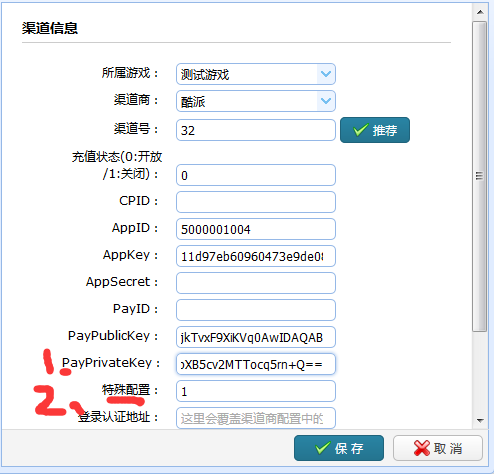
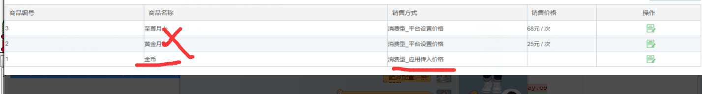

渠道接入FAQ
=========

NOTE: 部分渠道SDK有一些特殊的需要注意的地方，这些地方可能跟代码和参数都没有什么关系，仅仅是一些特殊的开关或者后台配置。这里对这些渠道做一个纪录，方便遇到这些问题的同学查阅。如果你遇到了其他的问题或者其他的答案，可以随时报告给我们


魅族
---------
**魅族为什么无法登陆**
```
1、魅族登录需要，去魅族网游QQ群(424013819)中，让他们运营开启联调，之后才可以登录
```

**魅族登录的时候，为什么logcat中有没有网络的提示，同时抛出找不到MzTelephonyManager这个类**
```
1、如果用的不是魅族的手机，需要到应用程序管理中找到“魅族网络游戏框架”这个应用，在详情界面的权限管理中，开启网络访问的权限。然后再次登陆即可
```

**魅族为什么没有浮标?**
```
1、如果用的不是魅族的手机，需要到应用程序管理中找到“魅族网络游戏框架”这个应用，在详情界面的权限管理中，开启网络访问的权限和浮标权限。然后再次打开游戏应用，即可看到
```

安智
---------
**安智支付界面的支付选项为什么无法切换？**
```
1、安智的支付选项，需要安智的人在后台分配支付选项之后，才能选择，否则是选择不了的
```

乐视
---------
**乐视调不出支付界面**
```
1、看下PayParams中传的productID，长度不能超过30个字符
```


应用宝(YSDK)
---------
**QQ和微信登录失败，或者提示“当前应用版本太低，...”，这是为什么？**
```
1、检查参数设置，保证包名，apk签名和申请参数时保持一致，检查参数设置是否正确
2、检查后台是否同步沙箱环境
3、客户端参数配置中的沙箱地址https://ysdktest.qq.com
4、沙箱测试完毕之后，记得将地址改为现网地址https://ysdk.qq.com
```

**客户端支付失败**
```
1、检查元宝icon是否正确配置

        <channel>
            <param name="id" value="51" />
            <param name="name" value="ysdk" />
            <param name="sdk" value="ysdk" />
            <param name="desc" value="腾讯应用宝(YSDK)" />
            <param name="suffix" value="com.tencent.tmgp.sdtx" />
            <param name="splash" value="0" />
            <param name="splash_copy_to_unity" value="0" />

            <sdk-params>

                <param name="QQ_APP_ID" value="1105283027" desc="QQAppID"/>
                <param name="WX_APP_ID"  value="wx5f01cf0f152b4288" desc="微信AppID"/> 
                <param name="OFFER_ID" value="1105283027" desc="OfferId,一般就是QQ AppId"/>

                <param name="YSDK_URL" value="https://ysdktest.qq.com" desc="沙箱环境是https://ysdktest.qq.com；正式环境是https://ysdk.qq.com"/>
                <param name="WG_FIXEDPAY" value="true"  desc="是否定额支付 true|false"/> 
                <param name="WG_RATIO" value="10"  desc="后台配置的比例，如果是1:10，那么填10"/> 
                <param name="WG_COIN_ICON_NAME" value="coin_icon" desc="支付界面游戏币Icon名称，drawable资源目录下的文件名称，不带后缀"/>    

                <param name="WG_MULTI_SERVERS" value="false" desc="true|false"/>    

                <param name="WG_QUERY_URL" value="http://192.168.18.9:8080/pay/ysdknew/query" desc="u8server处理查询充值逻辑的地址"/>  
                <param name="WG_PAY_URL" value="http://192.168.18.9:8080/pay/ysdknew/charge" desc="u8server处理查询充值逻辑的地址"/>

            </sdk-params>

            <sdk-version>
                <versionCode>1</versionCode>   
                <versionName>1.1.1</versionName>
            </sdk-version>              

        </channel>

应用宝渠道参数中，有一个WG_COIN_ICON_NAME配置项，用于配置游戏中游戏币的图标名称。
比如game1中，这里配置的名称是 coin_icon， 那么最终的apk的drawable中，需要有一张coin_icon.png，大小48*48 px

这张图片可以放到 : 打包工具/games/当前游戏/channels/YSDK对应渠道号(game1下是渠道号是51)/res/drawable/coin_icon.png                         

```

**服务器端支付失败**
```
1、检查u8server后台应用宝YSDK的参数配置，appid和appkey分别对应QQ AppID和沙箱的key（正式上线，换为现网key）
2、在渠道管理－》编辑－》在特殊配置中填上应用宝后台设置的支付兑换比例
3、保证客户端打包工具/games/games.xml中游戏中的appID和appkey是否和u8server后台游戏管理中当前游戏的appID和appKey一致
4、沙箱测试完毕之后，记得将u8server后台渠道商管理中应用宝YSDK中的“渠道下单地址”改为现网地址(https://ysdk.qq.com)
```

**首次安装游戏，提示安装腾讯充值，安装完之后，返回游戏拉不出支付界面，必须退出游戏之后，重新接入才能拉去**
```
1、目前得到应用宝官方的确认，这个是应用宝已知的BUG，暂时只能这样了
```

酷派
---------

**U8Server上 /pay/getOrderID 的时候出现错误，InvalidKeySpecException: java.security.InvalidKeyException: IOException**

```
1、检查U8Server后台管理中的私钥和公钥配置
```

```
酷派需要下单用的是PayPrivateKey中配置的酷派给的支付私钥。你们用的是公钥。

酷派分配的私钥，可能需要通过酷派的cptools进行转换，转换为pck8的格式。

酷派特殊配置中，需要配置waresid。 Waresid是你们在酷派后台商品中，配置一条类型为“消费型--应用传入价格”类型的商品条目的ID
```

```
比如图中， 这条的商品编号是1,那么特殊配置这里，就配置为1
```

联想
---------
**联想为什么没有浮标？**
```
1、如果是小米手机，那么需要在应用程序管理中，找到该游戏，然后在详情界面的权限管理中开启浮标权限
2、联想SDK，如果后台没有开启“攻略”、“礼包”、“论坛”三个中至少一个，那么SDK会自动隐藏浮标
```

**点击游戏内的购买按钮， 出现【充值失败】的提示。**

```
1、联想，需要在后台配置商品条目， 然后将联想后台配置的商品条目和游戏中的商品条目的ID映射关系配置到lenovo_pay.xml中

联想的和酷派的类似， 需要在后台配置商品。 但是联想不能只配置一条商品。 需要你们将游戏中的各个商品都配置到后台，然后，你们需要将后台生成的商品ID和游戏中的商品ID的映射关系，配置到lenovo_pay.xml中

这个文件，配置完成之后可以放在打包工具/games/当前游戏/channels/联想对应的渠道号/assets/lenovo_pay.xml中

这个文件模板可以打包工具/config/sdk/lenovo/assets目录下拷贝

```

木蚂蚁
---------

**木蚂蚁支付回调处理错误，接收不到参数**
```
1、U8Server中木蚂蚁的回调参数采用json格式接收，需要告诉木蚂蚁的技术，将回调参数的格式，修改为json格式，而不是默认的格式。否则接收不到参数
```


