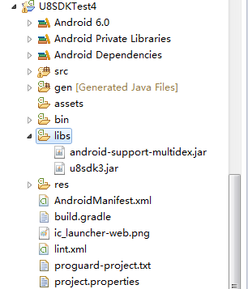
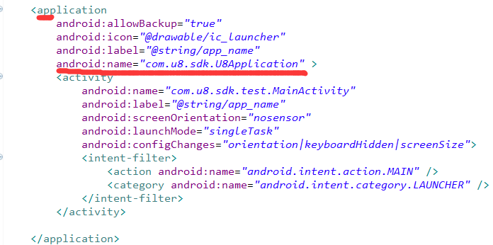
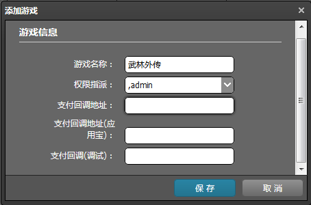
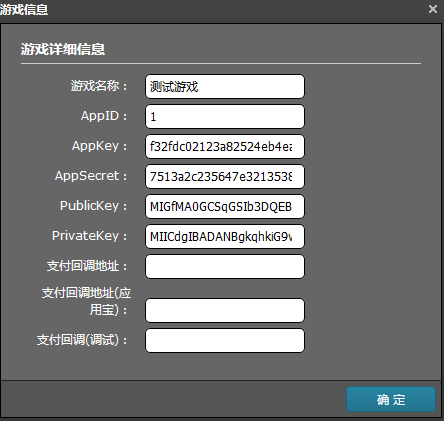

游戏接入指南
======

NOTE:这篇文档，基于最新版本的U8SDK框架，如果发现该文档和你使用的版本不匹配，则以你使用的版本对应的文档为准。

NOTE:2016年12月12号以前的版本，请看这里：[抽象层API调用](quickstart.md)

引入jar包
-------

将 u8sdk*.jar和android-support-multidex.jar 放到游戏接入工程中的libs目录下




配置Application
-------

如果游戏层没有自己的Application，那么游戏需要将AndroidManifest.xml中的application指定为 com.u8.sdk.U8Application。




如果游戏有自己的Application， 则可以看我们这里的解决方案：[自定义Application](android_custom_application.md)


必须调用的接口
-------

NOTE:所有接口调用，都通过com.u8.sdk.platform.U8Platform 单例类来调用

1、初始化(必接)

**该方法必须在游戏启动Activity的onCreate方法中，调用**

~~~~~~

        U8Platform.getInstance().init(this, new U8InitListener() {
            
            @Override
            public void onSwitchAccount(UToken data) {
                //游戏中通过SDK切换到新账号的回调，游戏收到该回调，需要引导用户重新登录，重新加载该新用户对应的角色数据           
            }
            
            @Override
            public void onPayResult(int code, String msg) {
                
                Log.d("U8SDK", "pay result. code:"+code+";msg:"+msg);
                
                switch(code){
                case U8Code.CODE_PAY_SUCCESS:
                    Toast.makeText(MainActivity.this, "支付成功", Toast.LENGTH_LONG).show();
                    break;
                case U8Code.CODE_PAY_FAIL:
                    Toast.makeText(MainActivity.this, "支付失败", Toast.LENGTH_LONG).show();
                    break;
                    
                case U8Code.CODE_PAY_CANCEL:
                    Toast.makeText(MainActivity.this, "支付取消", Toast.LENGTH_LONG).show();
                    break;
                case U8Code.CODE_PAY_UNKNOWN:
                    Toast.makeText(MainActivity.this, "未知错误", Toast.LENGTH_LONG).show();
                    break;
                }
                
            }
            
            @Override
            public void onLogout() {
                //用户登出回调（需要收到该回调需要返回游戏登录界面，并调用login接口，打开SDK登录界面）
            }
            
            //渠道SDK登录并去u8server登录认证成功，会回调改方法。
            //UToken中的参数如下：
            //userID:U8Server生成的唯一用户ID，游戏服务器需要将游戏账户ID和该userID进行绑定。
            //sdkUserID:渠道SDK平台用户唯一ID，一般不需要使用
            //username:U8Server生成的用户名，比如234234234.uc,4353453453.baidu,65756756756.360
            //sdkUserName:渠道SDK平台用户名，可能为空，部分渠道SDK没有返回用户名
            //token:U8Server生成的会话ID，游戏服务器拿该字段去U8Server做二次登录验证
            //extension:U8Server返回的扩展字段，部分渠道SDK需要，游戏中无需使用该字段的值
            //timestamp:U8Server生成的时间戳，游戏服务器去U8Server做二次登录验证时，传给U8Server            
            @Override
            public void onLoginResult(int code, UToken data) {
                switch(code){
                case U8Code.CODE_LOGIN_SUCCESS:
                    
                    //进入游戏 
                    //从UToken中获取用户信息
                    break;
                case U8Code.CODE_LOGIN_FAIL:
                    Toast.makeText(MainActivity.this, "登录失败", Toast.LENGTH_LONG).show();
                    break;
                }
            }
            
            @Override
            public void onInitResult(int code, String msg) {
                Log.d("U8SDK", "init result.code:"+code+";msg:"+msg);
                switch(code){
                case U8Code.CODE_INIT_SUCCESS:
                    Toast.makeText(MainActivity.this, "初始化成功", Toast.LENGTH_LONG).show();
                    break;
                case U8Code.CODE_INIT_FAIL:
                    Toast.makeText(MainActivity.this, "初始化失败", Toast.LENGTH_LONG).show();
                    break;
                }
            }
        });

~~~~~~

2、登录接口(必接)

调用登录接口，打开SDK登录界面，登录成功或者失败，会触发上面初始化监听器中的onLoginResult回调函数

~~~~~~

    U8Platform.getInstance().login(this);

~~~~~~

3、登出接口(选接)

调用登出接口， SDK账户登出， 但是不是每个SDK都具有登出逻辑，对应没有提供登出接口的SDK，调用该函数，什么也不操作

~~~~~~

    U8Platform.getInstance().logout();

~~~~~~

4、提交扩展数据(必接)

Note: 部分渠道要求在 选择服务器，创建角色，登录游戏，角色升级，退出游戏 等时刻，必须要上报游戏中玩家数据，以便渠道后台统计用户数据。所以，游戏层需要在特定的地方多次调用该方法。

~~~~~~

    private void submitExtraData(final int dataType){
        UserExtraData data = new UserExtraData();
        data.setDataType(dataType);
        data.setMoneyNum(100);
        data.setRoleCreateTime(System.currentTimeMillis()/1000);
        data.setRoleID("role_100");
        data.setRoleName("test_112");
        data.setRoleLevel("10");
        data.setRoleLevelUpTime(System.currentTimeMillis()/1000);
        data.setServerID(10);
        data.setServerName("server_10");
        U8Platform.getInstance().submitExtraData(data);
    }    

~~~~~~

该方法将调用的时机分为几种类型：

1：选择服务器
2：创建角色
3：进入游戏
4：等级提升
5：退出游戏

所以在上面5个地方，都需要调用
U8User.getInstance().submitExtraData(UserExtraData extraData)

其中，UserExtraData就是游戏内玩家的数据，比如在选择服务器时，extraData中的dataType为1；创建角色的时候，dataType为2；进入游戏时，dataType为3；等级提升时，dataType为4；退出游戏时，dataType为5

NOTE:选择服务器时，因为还没有进入游戏，无法知道角色数据，extraData中只需要传入服务器信息即可。

关于UserExtraData 数据结构:


| 参数名称        | 参数类型          | 参数说明  |
|:------------- |:-------------|:-----|
| dataType     | int | 调用时机|
| serverID| String| 玩家所在服务器的ID|
| serverName| String| 玩家所在服务器的名称|
| roleID | String | 玩家角色ID|
| roleName| String | 玩家角色名称|
| roleLevel| String | 玩家角色等级|
| moneyNum| String | 当前角色身上拥有的游戏币数量|
| roleCreateTime| long | 角色创建时间，从1970年到现在的时间，单位秒,必须传入真实的数据，否则UC审核不过|
| roleLevelUpTime| long | 角色等级变化时间，从1970年到现在的时间，单位秒|
| vip| String | 玩家VIP等级|


5、退出游戏(必接)

当玩家点击手机上返回键或者游戏中【退出游戏】按钮时，部分渠道SDK会弹出一个“退出确认对话框”，让玩家确认退出，或者取消退出

游戏层需要在U8ExitListener的onGameExit中， 来调用游戏自己的退出游戏确认弹窗（对于没有提供退出确认弹窗接口的SDK，会触发该回调）

~~~~~~

        U8Platform.getInstance().exitSDK(new U8ExitListener() {
            
            @Override
            public void onGameExit() {

                //游戏自己的退出确认框
                AlertDialog.Builder builder = new AlertDialog.Builder(MainActivity.this);
                builder.setTitle("退出确认");
                builder.setMessage("主公，现在还早，要不要再玩一会？");
                builder.setCancelable(true);
                builder.setPositiveButton("好吧",
                        new DialogInterface.OnClickListener() {
                            public void onClick(DialogInterface dialog,
                                    int whichButton) {
                                //这里什么都不用做
                            }
                        });
                builder.setNeutralButton("一会再玩",
                        new DialogInterface.OnClickListener() {
                            public void onClick(DialogInterface dialog,
                                    int whichButton) {
                                //退出游戏
                                MainActivity.this.finish();
                                System.exit(0);
                            }
                        });
                builder.show(); 
                
            }
        });

~~~~~~

6、支付充值(必接)

调用充值接口，打开SDK充值界面。 充值成功或者失败，会触发上面初始化监听器中的onPayResult接口

~~~~~~

        PayParams params = new PayParams();
        params.setBuyNum(1);        //购买数量，固定1
        params.setCoinNum(100);     //当前玩家身上拥有的游戏币数量
        params.setExtension(System.currentTimeMillis()+""); //游戏自定义数据，充值成功，回调游戏服的时候，会原封不动返回
        params.setPrice(1);         //单位 整数 元
        params.setProductId("1");   //产品ID
        params.setProductName("元宝");    //产品名称
        params.setProductDesc("购买100元宝");   //产品描述
        params.setRoleId("1");      //角色ID
        params.setRoleLevel(1);     //角色等级
        params.setRoleName("测试角色名");    //角色名称
        params.setServerId("10");       //服务器ID
        params.setServerName("测试");     //服务器名称
        params.setVip("vip1");          //角色VIP等级
        params.setPayNotifyUrl("http://www.game.com/pay/callback"); //支付成功，U8Server异步通知该地址，告诉游戏服务器发货
        
        U8Platform.getInstance().pay(this, params);

~~~~~~

关于PayParams对象：

| 参数名称        | 参数类型          | 参数说明  |
|:------------- |:-------------|:-----|
| productId     | String | 充值商品ID，游戏内的商品ID |
| productName      | String      |   商品名称，比如100元宝，500钻石...|
| productDesc| String      |    商品描述，比如 充值100元宝，赠送20元宝|
| price| int | 充值金额(单位：元)|
| buyNum| int | 购买数量，一般都是1|
| coinNum| int | 玩家当前身上剩余的游戏币 |
| serverID| String| 玩家所在服务器的ID|
| serverName| String| 玩家所在服务器的名称|
| roleID | String | 玩家角色ID|
| roleName| String | 玩家角色名称|
| roleLevel| String | 玩家角色等级|
| vip | String| 玩家vip等级 |
| payNotifyUrl| String | 游戏服务器支付回调地址，渠道SDK支付成功，异步通知U8Server，U8Server根据该地址，通知游戏服务器发货|
| extension | String | 支付成功之后，U8Server原样返回给游戏服务器|


生命周期函数(必接)
-------

在游戏启动Activity的如下生命周期函数中，调用对应的方法。

~~~~~~

    public void onActivityResult(int requestCode, int resultCode, Intent data){
        U8SDK.getInstance().onActivityResult(requestCode, resultCode, data);
        super.onActivityResult(requestCode, resultCode, data);
    }
    
    public void onStart(){
        U8SDK.getInstance().onStart();
        super.onStart();
    }
    
    public void onPause(){
        U8SDK.getInstance().onPause();
        super.onPause();
    }
    public void onResume(){
        U8SDK.getInstance().onResume();
        super.onResume();
    }
    public void onNewIntent(Intent newIntent){
        U8SDK.getInstance().onNewIntent(newIntent);
        super.onNewIntent(newIntent);
    }
    public void onStop(){
        U8SDK.getInstance().onStop();
        super.onStop();
    }
    public void onDestroy(){
        U8SDK.getInstance().onDestroy();
        super.onDestroy();
    }
    public void onRestart(){
        U8SDK.getInstance().onRestart();
        super.onRestart();
    }
    
    public void onConfigurationChanged(Configuration newConfig){
        super.onConfigurationChanged(newConfig);
    }

    public void onRequestPermissionsResult(int requestCode, String[] permissions, int[] grantResults){
        U8SDK.getInstance().onRequestPermissionResult(requestCode, permissions, grantResults);
    }

~~~~~~


打出渠道包
-------

上面代码写好之后， 直接导出apk包， 这个apk包，就是所谓的母包了。 接下来，就可以通过U8SDK一键打包工具，打出各个渠道的渠道包。

1、U8Server创建游戏，生成参数

进入U8Server管理后台，选择 游戏管理-》新建 创建一个新游戏， 创建游戏的时候， 会生成该游戏的 appID，appKey,appSecret等参数。



添加完游戏之后， 选中该游戏， 点击 菜单中【详情】 查看 该游戏生成的 appID， appKey等参数， 需要将appID和appKey告诉客户端同学，客户端同学，需要将这两个参数，配置到打包工具中(见下面)。



2、打包工具中创建游戏目录


2.1 客户端打包工具中，我们需要在U8SDKTool-Win-P34/games目录下，创建一个游戏目录(英文或者拼音命名)，比如叫game2，作为该游戏的打包工具配置目录。

**为了方便，将我们提供的game1中所有的东西，拷贝过来。**

然后，将上面我们打出的母包apk，重命名为u8.apk， 放到game2目录下

2.2 为了让打包工具，知道有这个游戏配置目录。 我们需要在games.xml中， 添加一条game记录。

~~~~~~

    <game>
        <param name="appName" value="game2" />     <!--游戏配置目录名称，上面目录是game2，这里就是game2-->
        <param name="appID" value="2" />            <!--U8Server生成的该游戏的appID-->
        <param name="appKey" value="f32fdc02123a82524eb4ea95e1383d0b" />  <!--U8Server生成的该游戏的appKey-->
        <param name="appDesc" value="测试游戏2" />
        <param name="orientation" value="landscape" desc="游戏是横屏还是竖屏(landscape|portrait),不配置默认是横屏" />        
        <param name="cpuSupport" value="armeabi|armeabi-v7a|x86|mips"/>     
        <param name="outputApkName" value="{channelName}_{buildNum}.apk" />     
    </game>

~~~~~~

打包工具中详细说明，以及各个配置字段的详细说明，可以看[打包工具详细说明文档](android_package.md)

3、配置游戏参数

**将上面game记录中的appID和appKey 设置为 U8Server后台创建游戏时，生成的appID和appKey的值**

4、打出渠道包

现在执行package.bat，选择游戏列表中，应该已经有这条game2了。 输入appID，进行渠道包的打包操作，就可以打出渠道包了。


游戏服务器端接口
-------

1、登录认证

客户端登录成功之后，U8Server返回userID和token等数据，客户端需要将该参数告诉游戏服务器，游戏服务器拿着这些参数，去U8Server进行一次登录认证。

```

登录认证地址：http://localhost:8080/user/verifyAccount (这里将前面localhost:8080改为你们自己的u8server根地址)
请求方式：POST或者GET
参数：
    userID：上面登录认证成功之后，U8Server返回的userID
    token：上面登录认证成功之后，U8Server返回的token
    sign：md5("userID="+userID+"token="+token+appSecret);这里游戏服务器按照格式生成一个md5串(32位小写)，appSecret是U8Server创建游戏时，生成的AppSecret

返回(JSON格式)：
    {
      state: 1(登录认证成功)；其他失败
      data: 认证成功才有数据，否则为空
          {
            userID:U8Server生成的唯一用户ID
            username:U8Server生成的统一格式的用户名
            channelID:渠道号

        }
    }

```

2、支付回调

当U8Server收到渠道SDK支付回调，并处理成功时，我们会调用游戏服的支付回调地址，通知游戏服给玩家发货。这个回调的地址， 客户端在调用支付接口的时候， 通过payNotifyUrl字段传入。

```

请求地址：游戏服接收请求的http地址，客户端支付的时候，传入。
请求方式：POST (application/json格式)
请求参数(JSON格式)：
    {
        state:状态，1：成功;其他失败
        data:{
            productID：商品ID
            orderID: 订单号
            userID: 用户ID
            channelID: 渠道ID
            gameID: 游戏ID
            serverID：游戏服务器ID
            money:充值金额，单位分
            currency：货币类型，默认RMB
            extension：获取订单号服务器传过来的自定义参数，原样返回

            signType：签名类型，目前支持md5和rsa，可以自己设定。 该字段不参与签名
            sign：签名值。 该字段不参与签名
        }
    }

返回：

游戏服处理成功，直接返回一个"SUCCESS"字符串到U8Server即可。失败，返回一个"FAIL"字符串。

```

游戏服务器sign验证规则：

首先对收到的data中的数据进行解析， 解析出来之后，除了signType和sign两个字段外(开源版本u8server的话，platID也不加入签名)， 其他所有的字段按照字母排列顺序进行组合,格式如下：

signStr = "channelID=5&currency=RMB&.....&userID=4344"

组合字符串最后，加上u8server为该游戏分配的SecretKey。 

signStr +=  "&" + SecretKey

这样得到的signStr，就是待校验的数据字符串了。

**如果signType=="md5"，那么就直接这样验证：**

String localSign = md5(signStr)
if(localSign == sign) return true;
else return false;

将本地生成的md5和收到的sign进行比对。 一致，则验证通过。  这里md5字符串为 32位小写

**如果signType=="rsa"，则验证方法如下：**

RSAUtils.verify(signStr, publicKey, "UTF-8");

RSAUtils类可以从U8Server代码中获取， publicKey是上面U8Server后台创建游戏时，为该游戏分配的支付公钥。

Java代码，验证签名示例：

```
    private boolean isSignOK(U8PayCallbackData order){

        String appSecret = "7513a2c235647e3213538c6eb329eec9";
        StringBuilder sb = new StringBuilder();
        sb.append("channelID=").append(order.getChannelID()).append("&")
                .append("currency=").append(order.getCurrency()).append("&")
                .append("extension=").append(order.getExtension()).append("&")
                .append("gameID=").append(order.getGameID()).append("&")
                .append("money=").append(order.getMoney()).append("&")
                .append("orderID=").append(order.getOrderID()).append("&")
                .append("productID=").append(order.getProductID()).append("&")
                .append("serverID=").append(order.getServerID()).append("&")
                .append("userID=").append(order.getUserID()).append("&")
                .append(appSecret);

        if("md5".equalsIgnoreCase(order.getSignType())){
            return EncryptUtils.md5(sb.toString()).toLowerCase().equals(order.getSign());
        }else{
            String publicKey = "MIGfMA0GCSqGSIb3DQEBAQUAA4GNADCBiQKBgQDtJvawWjhQhI+J3EnD3gvuh+t1zB4bOMW9PJUdk27YQDyiGVd42QdHLofdTN1yXKXYZR1Bmy4W1pZhucSoDdS7fGfkKHm3zRMsijNOiPWHg0spMEchI4YTlIC43iFVdzSPE/2sIZfrW/9MspXfuWqFySsTsf6c6qJc6A0bNKJhMwIDAQAB";
            return RSAUtils.verify(sb.toString(), order.getSign(), publicKey, "UTF-8", "SHA1withRSA");
        }
    }

```

U8Server生成sign的代码，在com.u8.server.web.SendAgent类中，方法如下：

```
    private static String generateSign(UOrder order, String signType){

        StringBuilder sb = new StringBuilder();
        sb.append("channelID=").append(order.getChannelID()).append("&")
                .append("currency=").append(order.getCurrency()).append("&")
                .append("extension=").append(order.getExtension()).append("&")
                .append("gameID=").append(order.getGame().getAppID()).append("&")
                .append("money=").append(order.getMoney()).append("&")
                .append("orderID=").append(order.getOrderID()).append("&")
                .append("productID=").append(order.getProductID()).append("&")
                .append("serverID=").append(order.getServerID()).append("&")
                .append("userID=").append(order.getUserID()).append("&")
                .append(order.getGame().getAppSecret());

        if("md5".equalsIgnoreCase(signType)){
            return EncryptUtils.md5(sb.toString()).toLowerCase();
        }else{
            return RSAUtils.sign(sb.toString(), order.getGame().getAppRSAPriKey(), "UTF-8");
        }

    }
```


