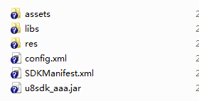
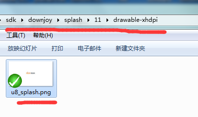
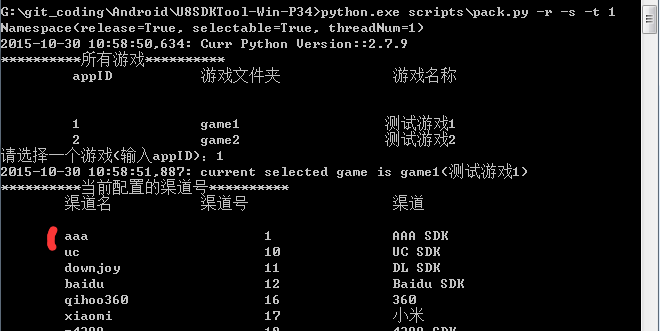

渠道SDK配置
======

NOTE:接好的渠道SDK，必须要配置到打包工具中，方可使用。打包工具的根目录为U8SDKTool-Win-P34

配置渠道jar包和资源
-------

1、新建渠道配置目录

```
所有当前打包工具支持的渠道SDK都统一放在U8SDKTool-Win-P34/config/sdk目录下。比如[上一篇]中我们接好了aaa渠道SDK。

我们现在需要配置到打包工具中，我们需要在这里新建一个子目录，并且以当前渠道名来命名，这个必须唯一。建议大家命名采用和工程统一的命名格式。比如之前我们的接入工程是U8SDK_AAA，那么我们这里新建一个aaa目录，作为aaa渠道的配置目录。

：U8SDKTool-Win-P34/config/sdk/aaa
```

2、拷贝渠道资源

NOTE:有的时候，渠道SDK提供的jar包中含有assets等资源目录，或者含有其他非class的文件，我们需要将所有的jar包给解压一下，然后查看其中是否含有这些文件。比如如果里面有assets，我们需要将assets里面的所有东西拷贝到aaa/assets目录下。否则反编译再次打包的时候，这些资源就丢失了。【切记】

```
之间接SDK的时候，注意我们只用到了jar包，仅仅将渠道SDK提供的jar包，拷贝到接入工程的libs中，使得我们在代码中可以引用到SDK的类和方法。

我们没有拷贝res，assets等资源，因为这个在接入的时候，我们并不需要。仅仅在最后打包的阶段，才需要合并到最终的渠道包中。

	1) 渠道SDK一般会提供一个Demo工程和一个库工程，我们去库工程中将libs,assets,res原封不动的拷贝到aaa目录中。
	2) 上一篇中，我们在bin目录下生成了最终的接入工程的jar包:u8sdk_aaa.jar文件。我们将这个jar文件拷贝到aaa目录下。
	3) 上一篇中，我们定义了一个config.xml和一个SDKManifest.xml文件，也拷贝到aaa目录下。	
	4) 解压libs中所有的jar包，看看里面有没有资源文件等，有的话，拷贝出来。assets中的东西就放到aaa/assets目录下。如果含有其他的非android格式的目录，而是自定义的目录或者文件，我们需要将这些目录和文件，按照在jar包中的目录结构，放到aaa/root目录下，没有root目录，则新建一个root目录。然后编辑config.xml，在operations节点中，增加一行：
	<operation step="5" type="copyRes" from="root" to="" />
	这个操作将root下所有的文件和目录，写入到最终apk的原来的对应目录中。

```

完成之后，配置目录如下：




配置闪屏
-------

NOTE:部分渠道要求游戏启动的时候先显示他提供的启动画面，通常他们会提供一张闪屏图片。部分渠道则将闪屏集成在了他们SDK的初始化接口中，无需我们这边操作，这种则不需要管闪屏了。注意，这里配置的闪屏，仅仅是渠道的闪屏，游戏如果自己也需要闪屏，逻辑自己处理。

1、U8SDK中闪屏的处理方式

```
因为U8SDK对多游戏的支持，所以渠道SDK的配置也要能服务于不同游戏的不同需求。所以U8SDK将闪屏分为如下四类：

	横屏白色背景：11
	横屏黑色背景：12
	竖屏白色背景：21
	竖屏黑色背景：22

对于竖屏的游戏，可以使用21,22类型的闪屏；横屏的游戏，可以使用11,12类型的闪屏

关于这里的详细说明，可以看之前[打包工具的说明](package_readme.md)中对闪屏配置的说明。或者，你可以参考我们博客上的文章：[统一闪屏解决方案](http://www.uustory.com/?p=1483)

```

2、配置aaa的闪屏目录

```
这里我们在aaa目录下，新建一个子目录splash，然后在splash下新建四个子目录，分别命名为11,12,21,22。
在各个目录中，放上对应的不同尺寸的子目录drawable-hdpi，drawable-ldpi，drawable-mdpi，drawable-xhdpi，drawable-xxhdpi，然后在这些资源目录中，放上对应尺寸的闪屏文件。闪屏文件的命名，必须为u8_splash.png

```

比如当乐渠道，我们配置好之后，闪屏的目录结构如下：




3、闪屏尺寸

各个目录下的闪屏尺寸如下：

|资源目录|横屏尺寸(11,12)|竖屏尺寸(21,22)|
|:-------|:--------------:|--------------:|
|drawable-ldpi | 320*240 px|240*320 px|
|drawable-mdpi | 480*320 px|320*480 px|
|drawable-hdpi | 800*480 px|480*800 px|
|drawable-xhdpi | 1280*720 px|720*1280 px|
|drawable-xxhdpi | 1920*1080 px|1080*1920 px|


配置角标(渠道没要求，略过此步)
-------

NOTE:部分渠道需要在游戏的图标上加上渠道的角标，传统方式是美术来完成这个工作，U8SDK中采用图片处理工具，自动将游戏图标叠加上对应的角标。

1、U8SDK中角标的处理方式

```
U8SDK中我们支持自动程序叠加设置好的角标到游戏图标上

游戏需要在游戏目录中的icon目录下放置一张大小512*512 px大小的ICON图片。这个ICON图片，就是游戏默认的图标。

需要附加角标的渠道，需要在渠道配置目录下新建一个icon_marks的目录，放置四张大小512*512 px大小的角标图片，为什么要四张呢？

为了适应不同游戏的不同需求，比如有的游戏适合将角标放在左上角，有的游戏适合将脚本放在右上角。所以，我们需要四张，图片名称固定，分别是

left-bottom.png:左下角
left-top.png：左上角
right-bottom.png：右下角
right-top.png：右上角

打包的时候，U8SDK会根据渠道当前的配置，来取对应的角标文件。然后缩放成不同的ICON尺寸。

```
关于ICON尺寸可以看这里([ICON和闪屏尺寸](http://www.uustory.com/?p=1783))。比如uc渠道的icon_marks中的角标图片：

   

2、配置aaa的角标

```
让美术根据aaa渠道提供的角标文件，做四张512*512 px的角标图片，必须是透明的png格式，角标分别处于左上角，左下角，右上角，右下角。

然后在aaa目录下，新建一个icon_marks目录，将这四张图片根据角标位置，分别命名为上面指定的名称。

```

最终合并之后的图标如下：

 


使用渠道
-------

经过上面的步骤，现在打包工具中所有的游戏，都可以使用该渠道SDK了。也就是说，当前打包工具又多支持了一个新的渠道SDK：aaa。那么比如我现在某个游戏需要使用aaa渠道怎么办呢？

之前我们说过，在U8SDK框架中接新的渠道，我们始终要想着这个渠道是可以给多个游戏使用的，所以，接入的时候，如果某个东西因游戏而异，我们最好将其放在配置中，让每个游戏去配置。还记得我们之前定义了一个config.xml，其中params中，我们定义了几个参数。

```
    <params>
        <param name="AAA_APPID"  required="1" showName="AppID" desc="渠道SDK分配的appID" bWriteInManifest="0" bWriteInClient="1" />
        <param name="AAA_APPKEY"  required="1" showName="AppKey" desc="渠道SDK分配的appKey" bWriteInManifest="0" bWriteInClient="1" /> 
        <param name="AAA_TEST"  required="1" showName="测试" desc="测试写入Manifest.xml" bWriteInManifest="1" bWriteInClient="0" />
        <param name="AAA_TEST2"  required="0" value="1" showName="测试2" desc="测试直接填写value" bWriteInManifest="1" bWriteInClient="0" />
    </params>
```

之前我们说过，除了required="0"的参数，其他参数，是因游戏而不同的。所以，需要各个游戏来配置，所以，在config.xml中，这些参数我们没有设置value=**。因为这个value=**，不同的游戏是不同的。

所以，在每个游戏的配置目录下，我们会建立一个config.xml，这个config.xml中，就是配置当前游戏对应的各个渠道的参数。他的大概结构如下：

```
<xml>

<!-- 	<global-plugins>
		<plugin name="bugly" desc="腾讯Bugly插件" />
	</global-plugins> -->

	<channels>

		<channel>
			<param name="id" value="10" />
			<param name="name" value="uc" />
			<param name="sdk" value="uc" />
			<param name="desc" value="UC SDK" />
			<param name="suffix" value=".uc" />	
			<param name="splash" value="0" />
			<param name="splash_copy_to_unity" value="0" />
			<param name="icon" value="rb" />

			<sdk-params>
				<param name="UCGameId" value="544156" desc="GameId"/>
				<param name="UCCpId" value="55398" desc="CpId"/>
				<param name="UCDebugMode" value="false" desc="是否开启调试模式(true|false)"/>
			</sdk-params>

<!-- 			<plugins>
				<plugin name="download" desc="apk 下载插件" />
				<plugin name="sharesdk" desc="Share SDK" />
			</plugins> -->

			<sdk-version>
				<versionCode>1</versionCode>   <!--versionCode用于渠道SDK的更新使用-->
				<versionName>3.5.3.1</versionName><!--versionName用于标识当前SDK的版本，和渠道SDK的版本一致-->
			</sdk-version>	

		</channel>		

		<channel>
			<param name="id" value="11" />
			<param name="name" value="downjoy" />
			<param name="sdk" value="downjoy" />
			<param name="desc" value="DL SDK" />
			<param name="suffix" value="com.downjoy.hj.sdk" />	
			<param name="splash" value="11" />
			<param name="splash_copy_to_unity" value="0" />	
			<param name="icon" value="rb" />

			<sdk-params>
				<param name="DLAppId" value="195" desc="APP_ID"/>
				<param name="DLAppKey" value="j5VEvxhc" desc="App_Key" />
				<param name="DLMerchantId" value="101" desc="CP_ID" />
				<param name="DLServerSeqNum" value="1" desc="当乐后台配置的服务器序列号" />
			</sdk-params>

			<sdk-version>
				<versionCode>1</versionCode>   <!--versionCode用于渠道SDK的更新使用-->
				<versionName>4.1</versionName><!--versionName用于标识当前SDK的版本，和渠道SDK的版本一致-->
			</sdk-version>					

		</channel>

	</channels>


</xml>

可以看到，当前游戏需要使用的所有渠道都配置在channels节点中，每个渠道用一个channel节点配置。

id:一号通分配的渠道号
name:渠道名称，保证唯一性
sdk:当前使用的SDK目录名称，必须和config下当前sdk的目录名称一致
desc:SDK 注明
suffix:包名后缀，也可以配置全包名。比如母包的包名是com.u8.sdk。这里配置了.uc那么，最终的包名是com.u8.sdk.uc。如果配置了全包名，比如duc.xhux.game.uc。那么最终的包名就是duc.xhux.game.uc。打包工具以是否以点号开头来区分是全包名还是后缀

splash:闪屏类型。还记得上面我们说的闪屏类型吧，如果你是横屏游戏，那么你需要横屏的闪屏文件，这里可以配置11，或者12。如果当前游戏是竖屏，那么可以配置成21,或者22

splash_copy_to_unity:unity有一个启动闪屏文件，如果是Unity项目，可以设置为"1"，将当前闪屏文件替换Unity默认闪屏（Unity工程项目适用）

icon:当前角标位置。如果没有角标需求，可以不配置这项。角标位置采用简写。比如lt,lb,rt,rb

left-top:lt
left-bottom:lb
right-top:rt
right-bottom:rb

sdk-version:用于和u8server对比使用的版本。versionCode会传到u8server，比如UC渠道有两个版本3.2和4.0。两个版本的渠道登录认证方式变化了不兼容。但是另一个游戏在使用3.2版本，现在无法升级渠道SDK版本。当前游戏需要使用4.0最新版本。那么u8server可以通过这个versionCode来区分当前需要使用哪个版本。

sdk-params:这里就是配置当前渠道SDK在config.xml中定义的params中的。所有上面定义在params中除了required="0"的参数，都需要定义在sdk-params中。

plugins:当前渠道支持的插件。这个后面说插件的时候，我们再具体的说。这里可以不用配置这个，删除这个节点。

```

所以，对于我们这个aaa的渠道SDK，我们新增一个channel节点，配置如下：

```
<channel>
	<param name="id" value="1" />
	<param name="name" value="aaa" />
	<param name="sdk" value="aaa" />
	<param name="desc" value="AAA SDK" />
	<param name="suffix" value=".aaa" />	
	<param name="splash" value="11" />
	<param name="splash_copy_to_unity" value="0" />
	<param name="icon" value="rb" />

	<sdk-params>
		<param name="AAA_APPID" value="4344" desc="appID" />
		<param name="AAA_APPKEY" value="dsdfsdfdsfdsfsdfaaaaa" desc="appkey" />
		<param name="AAA_TEST"  value="true" desc="测试" />
	</sdk-params>

	<sdk-version>
		<versionCode>1</versionCode>   <!--versionCode用于渠道SDK的更新使用-->
		<versionName>2.2</versionName><!--versionName用于标识当前SDK的版本，和渠道SDK的版本一致-->
	</sdk-version>	

</channel>

```

好了，到这里，当前游戏可以使用该渠道SDK进行打包了。运行打包工具，选择当前游戏，在渠道列表中就可以看到了：

