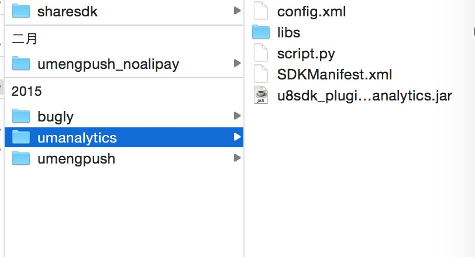
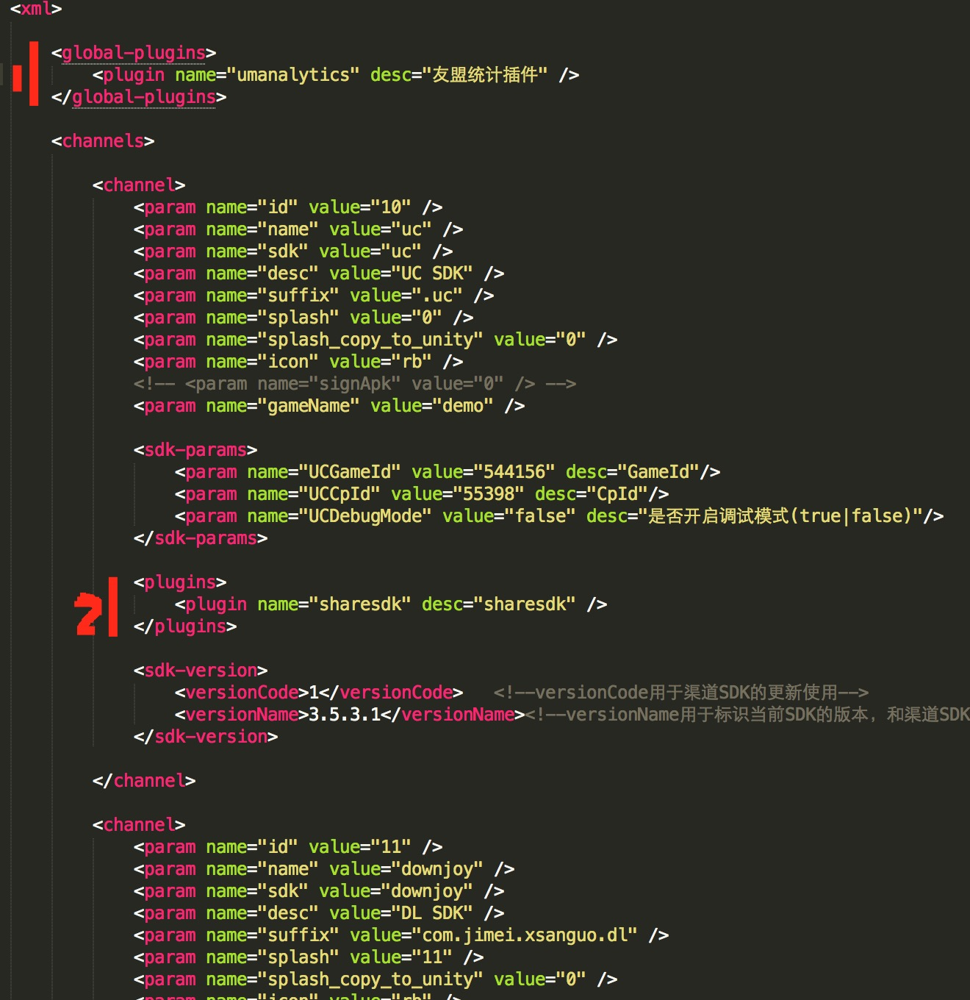

插件功能扩展
===========

NOTE:在U8SDK框架基础上不仅仅可以接入渠道SDK(包含登录和支付功能)，还可以接入诸如统计(友盟统计)、推送(友盟推送)、分享(ShareSDK)等和游戏运营等相关的功能型SDK


插件扩展原理
-------

插件的接入方式和渠道SDK的接入方式是一致的，这里需要明白的思路：

要让游戏和具体的插件解除耦合，和渠道SDK的思路都是一样的。渠道SDK，我们在U8SDK2抽象层中抽象出来两个接口， 一个是IUser，一个是IPay。分别对应用户登录功能和支付功能。

那么，现在我需要扩展出来一个统计功能，那么，我需要抽象出来一个IAnalytics接口，里面的方法定义就是统计等方法，比如我们现在抽象出来的IAnalytics接口：

```
public interface IAnalytics extends IPlugin{
	
	public static final int PLUGIN_TYPE = Constants.PLUGIN_TYPE_ANALYTICS;
	
	//开始关卡的时候，调用
	public void startLevel(String level);
	
	//关卡失败时，调用
	public void failLevel(String level);
	
	//关卡结束时，调用
	public void finishLevel(String level);
	
	//开始任务
	public void startTask(String task, String type);
	
	//任务失败
	public void failTask(String task);
	
	//完成任务
	public void finishTask(String task);
	
	//充值的时候调用
	public void pay(double money , int num);
	
	//游戏中所有虚拟消费，比如用金币购买某个道具都使用 buy 方法
	public void buy(String item, int num, double price);
	
	//消耗物品的时候，调用
	public void use(String item, int num, double price);
	
	//额外获取虚拟币时，trigger 触发奖励的事件, 取值在 1~10 之间，“1”已经被预先定义为“系统奖励”， 2~10 需要在网站设置含义。
	public void bonus(String item, int num, double price, int trigger);
	
	//登录的时候调用
	public void login(String userID);
	
	//登出的时候调用
	public void logout();
	
	//当玩家建立角色或者升级时，需调用此接口 
	public void levelup(int level);
}

```

比如，推送功能也是一样，我们需要抽象出来一个推送插件的接口IPush,目前U8SDK2抽象出来的推送插件接口如下：
```
public interface IPush extends IPlugin{

	public static final int PLUGIN_TYPE = Constants.PLUGIN_TYPE_PUSH;

	/**
	 * 执行通知
	 * @param msgs
	 */
	public void scheduleNotification(String msgs);
	
	/**
	 * 开始推送
	 */
	public void startPush();
	
	/**
	 * 停止推送
	 */
	public void stopPush();
	
	/**
	 * 添加tag
	 * @param tags
	 */
	public void addTags(String...tags);
	
	/**
	 * 删除tag
	 * @param tag
	 */
	public void removeTags(String...tag);
	
	/**
	 * 添加别名
	 * @param alias
	 */
	public void addAlias(String alias);
	
	/**
	 * 删除别名
	 * @param alias
	 */
	public void removeAlias(String alias);
}
```

所有的插件接口，都继承IPlugin接口。每个插件中方法的定义，可以参考需要接入的具体插件中有需要接入哪些功能。比如，我们的IAnalytics和IPush中接口的定义，是参考了友盟统计和友盟推送插件需要接入的功能点。

**每个插件，都需要定义一个唯一的插件类型，在Constants常量类中定义，这个是我们后面配置的时候，需要配置这个类型，然后初始化加载的时候，根据这个类型来判断当前是哪个插件。**

插件接口和插件类型定义好了之后，我们就可以封装一个单例类，给上层来调用接口中的方法，就像IUser和IPay提供的那样，IUser和IPay，我们提供了U8User和U8Pay两个单例类。那么对于IAnalytics和IPush，我们也一样，定义两个类U8Aanlytics和U8Push对接口中的类，做一个简单的封装，给上层来调用。

我们来看看这两个类：

```
public class U8Analytics {

	private static U8Analytics instance;
	
	private IAnalytics analyticsPlugin;
	
	private U8Analytics(){
		
	}
	
	public static U8Analytics getInstance(){
		if(instance == null){
			instance = new U8Analytics();
		}
		
		return instance;
	}
	
	public void init(){
		this.analyticsPlugin = (IAnalytics)PluginFactory.getInstance().initPlugin(IAnalytics.PLUGIN_TYPE);
	}
	
	/**
	 * 是否支持某个方法
	 * @param method
	 */
	public boolean isSupport(String method){
		if(analyticsPlugin == null){
			return false;
		}
		return analyticsPlugin.isSupportMethod(method);
	}
	
	//开始关卡的时候，调用
	public void startLevel(String level){
		if(analyticsPlugin == null){
			return;
		}
		
		analyticsPlugin.startLevel(level);
	}
	
	//关卡失败时，调用
	public void failLevel(String level){
		if(analyticsPlugin == null){
			return;
		}
		
		analyticsPlugin.failLevel(level);
	}
	
	//关卡结束时，调用
	public void finishLevel(String level){
		if(analyticsPlugin == null){
			return;
		}
		
		analyticsPlugin.finishLevel(level);
	}
	
	//开始任务
	public void startTask(String task, String type){
		if(analyticsPlugin == null){
			return;
		}
		analyticsPlugin.startTask(task, type);
	}
	
	//任务失败
	public void failTask(String task){
		if(analyticsPlugin == null){
			return;
		}
		analyticsPlugin.failTask(task);
	}
	
	//结束任务
	public void finishTask(String task){
		if(analyticsPlugin == null){
			return;
		}
		analyticsPlugin.finishTask(task);
	}
	
	//充值的时候调用
	public void pay(double money , int num){
		if(analyticsPlugin == null){
			return;
		}
		analyticsPlugin.pay(money, num);
	}
	
	//游戏中所有虚拟消费，比如用金币购买某个道具都使用 buy 方法
	public void buy(String item, int num, double price){
		if(analyticsPlugin == null){
			return;
		}
		
		analyticsPlugin.buy(item, num, price);
	}
	
	//消耗物品的时候，调用
	public void use(String item, int num, double price){
		if(analyticsPlugin == null){
			return;
		}
		analyticsPlugin.use(item, num, price);
	}
	
	//额外获取虚拟币时，trigger 触发奖励的事件, 取值在 1~10 之间，“1”已经被预先定义为“系统奖励”， 2~10 需要在网站设置含义。
	public void bonus(String item, int num, double price, int trigger){
		if(analyticsPlugin == null){
			return;
		}
		analyticsPlugin.bonus(item, num, price, trigger);
	}
	
	//登录的时候调用
	public void login(String userID){
		if(analyticsPlugin == null){
			return;
		}
		analyticsPlugin.login(userID);
	}
	
	//登出的时候调用
	public void logout(){
		if(analyticsPlugin == null){
			return;
		}
		analyticsPlugin.logout();
	}
	
	//当玩家建立角色或者升级时，需调用此接口 
	public void levelup(int level){
		if(analyticsPlugin == null){
			return;
		}
		analyticsPlugin.levelup(level);
	}
	
}
```
```
public class U8Push {

	private static U8Push instance;
	
	private IPush pushPlugin;
	
	private U8Push(){
		
	}
	
	public void init(){
		this.pushPlugin = (IPush)PluginFactory.getInstance().initPlugin(IPush.PLUGIN_TYPE);
	}
	
	public static U8Push getInstance(){
		
		if(instance == null){
			instance = new U8Push();
		}
		
		return instance;
	}
	
	public boolean isSupport(String method){
		if(isPluginInited()){
			return this.pushPlugin.isSupportMethod(method);
		}
		
		return false;
	}
	
	public void scheduleNotification(String msgs)
	{
		if(isPluginInited()){
			this.pushPlugin.scheduleNotification(msgs);
		}
	}
	
	/**
	 * 开始推送功能
	 */
	public void startPush(){
		if(isPluginInited()){
			this.pushPlugin.startPush();
		}
		
	}
	
	/**
	 * 停止推送功能
	 */
	public void stopPush(){
		if(isPluginInited()){
			this.pushPlugin.stopPush();
		}
	}
	
	/**
	 * 增加标签
	 * 您可以为用户加上标签，方便推送时按照标签来筛选。
	 * 目前每个用户tag限制在64个， 每个tag 最大256个字符。
	 * 
	 * 1、可为每个用户打多个标签。 
     * 2、不同应用程序、不同的用户，可以打同样的标签。 
	 * @param tags
	 */
	public void addTags(String...tags){
		if(isPluginInited()){
			this.pushPlugin.addTags(tags);
		}
	}
	
	/**
	 * 删除标签
	 * @param tags
	 */
	public void removeTags(String...tags){
		if(isPluginInited()){
			this.pushPlugin.removeTags(tags);
		}
	}
	
	/**
	 * 增加别名
	 * 为安装了应用程序的用户，取个别名来标识。以后给该用户 Push 消息时，就可以用此别名来指定。 
     * 1、每个用户只能指定一个别名。 
     * 2、同一个应用程序内，对不同的用户，建议取不同的别名。这样，尽可能根据别名来唯一确定用户。 
     * 3、系统不限定一个别名只能指定一个用户。如果一个别名被指定到了多个用户，当给指定这个别名发消息时，服务器端API会同时给这多个用户发送消息。 
     * 举例：在一个用户要登录的游戏中，可能设置别名为 userid。游戏运营时，发现该用户 3 天没有玩游戏了，则根据 userid 调用服务器端API发通知到客户端提醒用户。 	 * 
	 * @param alias
	 */
	public void addAlias(String alias){
		if(isPluginInited()){
			this.pushPlugin.addAlias(alias);
		}
	}
	
	/**
	 * 删除别名
	 * @param alias
	 */
	public void removeAlias(String alias){
		if(isPluginInited()){
			this.pushPlugin.removeAlias(alias);
		}
	}
	
	private boolean isPluginInited(){
		if(this.pushPlugin == null){
			Log.e("U8SDK", "The push plugin is not inited or inited failed.");
			return false;
		}
		return true;
	}
}
```

可以看到上面两个封装类中，都定义了一个init方法，里面都调用了PluginFactory的initPlugin方法。然后，我们需要在U8SDK类的init方法中调用一下这两个类中的init方法

现在U8SDK的init方法如下：

```
	public void init(Activity context){
		this.context = context;
		try{
			U8User.getInstance().init();
			U8Pay.getInstance().init();
			U8Share.getInstance().init();
			U8Analytics.getInstance().init();
			U8Push.getInstance().init();
			U8Download.getInstance().init();
		}catch(Exception e){
			e.printStackTrace();
		}

	}
```

到这里，抽象层中我们的插件扩展就定义好了。游戏层中比如需要接入统计功能，他不再需要说是接友盟还是DataEye插件，他只需要调用我们封装的U8Analytics中的方法即可。


插件接入
-------

通过上面的工作，我们发现插件的设计思路和渠道SDK是完全一致的。 那么插件的接入和渠道SDK也就没有什么不同了。 这里，还不熟悉渠道SDK的接入步骤的，可以看下，我们渠道SDK的接入视频教程或者渠道SDK接入文档。

插件接入也是一样， 比如我们需要接入友盟统计。那么，我们首先新建一个接入工程U8SDK_Plugin_UMAnalytics，然后引入U8SDK2依赖工程。同时，将友盟统计提供的jar包，拷贝到这个工程的libs目录中

接下来，我们的步骤就是和接入渠道SDK一样了，我们定义一个类UMAnalytics，实现IAnalytics接口（还记得之前接入渠道SDK的时候，我们是定义两个类，分别实现IUser和IPay接口吧。这里方式也是一样）:

```
public class UMAnalytics implements IAnalytics{

	private String[] supportedMethods = {"startLevel", "failLevel", "finishLevel","pay","buy","use","bonus","login","logout","levelup"};
	
	public UMAnalytics(Activity context){
		UMAnalyticsSDK.getInstance().initSDK(U8SDK.getInstance().getSDKParams());
	}
	
	@Override
	public boolean isSupportMethod(String methodName) {
		
		return Arrays.contain(supportedMethods, methodName);
	}

	@Override
	public void startLevel(String level) {
		UMAnalyticsSDK.getInstance().startLevel(level);
	}

	@Override
	public void failLevel(String level) {
		UMAnalyticsSDK.getInstance().failLevel(level);
	}

	@Override
	public void finishLevel(String level) {
		UMAnalyticsSDK.getInstance().finishLevel(level);
		
	}

	@Override
	public void pay(double money, int num) {
		UMAnalyticsSDK.getInstance().pay(money, num);
	}

	@Override
	public void buy(String item, int num, double price) {
		UMAnalyticsSDK.getInstance().buy(item, num, price);
		
	}

	@Override
	public void use(String item, int num, double price) {
		UMAnalyticsSDK.getInstance().use(item, num, price);
	}

	@Override
	public void bonus(String item, int num, double price, int trigger) {
		UMAnalyticsSDK.getInstance().bonus(item, num, price, trigger);
	}

	@Override
	public void login(String userID) {
		UMAnalyticsSDK.getInstance().login(userID);
	}

	@Override
	public void logout() {
		UMAnalyticsSDK.getInstance().logout();
	}

	@Override
	public void levelup(int level) {
		UMAnalyticsSDK.getInstance().levelup(level);
	}

	@Override
	public void startTask(String task, String type) {
		// TODO Auto-generated method stub
		
	}

	@Override
	public void failTask(String task) {
		// TODO Auto-generated method stub
		
	}

	@Override
	public void finishTask(String task) {
		// TODO Auto-generated method stub
		
	}

}
```

**注意，所有的插件实现类，都必须有一个构造函数含有一个Activity参数的，不要忘记了**

可以看到这些实现方法中，我们调用了UMAnalyticsSDK单例类中的方法。这也和我们之前渠道SDK接入方法中说的一致。 每个SDK的方法，我们都封装在了一个单例类中。我们看看UMAnalyticsSDK单例类:

```
public class UMAnalyticsSDK {

	private static UMAnalyticsSDK instance;
	
	private int paySource = 21;
	
	private UMAnalyticsSDK(){}
	
	public static UMAnalyticsSDK getInstance(){
		if(instance == null){
			instance = new UMAnalyticsSDK();
		}
		return instance;
	}
	
	public void initSDK(SDKParams params){
		
		this.paySource = params.getInt("UMENG_PAYSOURCE");
		
		U8SDK.getInstance().setActivityCallback(new ActivityCallbackAdapter(){
			@Override
			public void onPause() {
				UMGameAgent.onPause(U8SDK.getInstance().getContext());
			}

			@Override
			public void onResume() {
				UMGameAgent.onResume(U8SDK.getInstance().getContext());
			}			
		});
		
		UMGameAgent.setDebugMode(true);
		UMGameAgent.init(U8SDK.getInstance().getContext());
		
	}
	
	/**
	 * 在游戏开启新的关卡的时候调用 UMGameAgent.startLevel(level) 方法，在关卡失败的时候调用
	 *  UMGameAgent.failLevel(level) 方法，在成功过关的时候调用 UMGameAgent.finishLevel(level) 方法。
	 *  调用 failLevel 或 finishLevel 的时候会计算从 startLevel 开始的时长，
	 *  作为这一关卡的耗时。level 字段最好为非空可排序的字符串。
	 *  SDK 会默认减去程序切入后台的时间，可以设置 UMGameAgent.setTraceSleepTime(false); 
	 *  来关闭默认设置，这样统计到的关卡时长是从 startLevel 到 failLvel(finishLevel) 之间的真实时长。
	 * @param level
	 */
	public void startLevel(String level){
		UMGameAgent.startLevel(level);
	}
	
	public void failLevel(String level){
		UMGameAgent.failLevel(level);
	}
	
	public void finishLevel(String level){
		UMGameAgent.finishLevel(level);
	}
	
	/***
	 * 在游戏中充值或者购买虚拟币的时候调用此方法，比如通过支付宝用 10元钱 购买了 1000 个金币，可以这样调用：
	 * UMGameAgent.pay(10,1000,2);
	 * 
	 * 
	 * @param money 本次消费的金额(非负数) 
	 * @param num 购买数量
	 */
	public void pay(double money, int num){
		UMGameAgent.pay(money, num, paySource);
	}
	
	/**
	 * 游戏中所有虚拟消费，比如用金币购买某个道具都使用 buy 方法
	 * 
	 * 比如在游戏中使用金币购买了1个头盔，一个头盔价值 1000 金币，可以这样统计：
	 * UMGameAgent.buy("helmet", 1, 1000);
	 * 
	 * @param item 购买物品的ID 
	 * @param num 购买物品数量 
	 * @param price 购买物品的单价(虚拟币)
	 */
	public void buy(String item, int num, double price){
		UMGameAgent.buy(item, num, price);
	}
	
	/**
	 * 游戏中的物品损耗，比如使用了2瓶魔法药水,每个需要50个虚拟币，可以这样统计：
	 * UMGameAgent.use("magic_bottle", 2 , 50);
	 * 
	 * @param item 消耗的物品ID
	 * @param num 消耗物品数量
	 * @param price 物品单价（虚拟币）
	 */
	public void use(String item, int num, double price){
		UMGameAgent.use(item, num, price);
	}
	
	/***
	 * 针对游戏中额外获得的虚拟币进行统计，比如系统赠送，节日奖励，打怪掉落。
	 * 如果是掉落道具,比如掉落一把价值100金币的宝剑可以这样调用：
	 * UMGameAgent.bonus("sword", 1, 100, 1);
	 * @param item 奖励物品ID 
	 * @param num 奖励物品数量 
	 * @param price 物品的虚拟币单价 
	 * @param trigger 触发奖励的事件, 取值在 1~10 之间，“1”已经被预先定义为“系统奖励”， 2~10 需要在网站设置含义。
	 */
	public void bonus(String item, int num, double price, int trigger){
		UMGameAgent.bonus(item, num, price, trigger);
	}
	
	/***
	 * 玩家帐号登录统计
	 */
	public void login(String userID){
		UMGameAgent.onProfileSignIn("C_"+U8SDK.getInstance().getCurrChannel(), userID);
	}
	
	/**
	 * 玩家帐号登出统计
	 */
	public void logout( ){
		UMGameAgent.onProfileSignOff();
	}
	
	/**
	 * 当玩家建立角色或者升级时，需调用此接口 
	 * @param level
	 */
	public void levelup(int level){
		UMGameAgent.setPlayerLevel(level);
	}
}

```
在这个单例类中的各个方法中，我们调用了友盟统计插件提供的API。这样，我们代码部分的工作就做完了。 如果是推送插件的话，也是一样。只是我们定义一个实现IPush接口的类，然后在这些方法中调用友盟推送提供的API。

插件代码接入完成之后，和渠道SDK接入一样，我们需要定义两个配置文件：config.xml和SDKManifest.xml。文件可以从已有的渠道SDK接入工程中拷贝。

我们先看看我们这里的config.xml配置文件：

```
<?xml version="1.0" encoding="UTF-8"?>
<config>
    
    <params>
        <param name="UMENG_APPKEY" value="54a0e798fd98c56c8000077f" required="1" showName="AppKey" desc="友盟分析统计" bWriteInManifest="1" bWriteInClient="0" />
        <param name="UMENG_CHANNEL" value="Channel" required="1" showName="渠道号（通过自定义脚本，动态设置为渠道名称）" desc="友盟分析统计" bWriteInManifest="1" bWriteInClient="0" />
        <param name="UMENG_PAYSOURCE" value="21" required="1" showName="支付来源(友盟后台添加，从20之后开始)" desc="友盟分析统计" bWriteInManifest="0" bWriteInClient="1" />
    </params>
    
    <operations>
        <operation step="1" type="mergeManifest" from="SDKManifest.xml" to="AndroidManifest.xml" />
        <operation step="2" type="copyRes" from="assets" to="assets" />
        <operation step="3" type="copyRes" from="libs" to="lib" />
        <operation step="4" type="copyRes" from="res" to="res" />
        <operation step="5" type="script" from="script.py" to="" />
    </operations>
    
    <plugins>
        <plugin name="com.u8.sdk.UMAnalytics" type="5" desc="统计分析插件"/>
    </plugins>

    <version>
        <name>友盟统计插件</name>
        <versionCode>1</versionCode>
        <versionName>5.5.3.0</versionName>
    </version>    
    
</config>
```
可以看到，这个配置文件和渠道SDK文件完全一样，唯一需要注意的地方就是，plugins节点中，我们配置了IAnalytics的实现类的完整类名，同时后面type字段，也就是插件类型字段，我们这里是5，对应上面我们在抽象层中给统计插件定义的插件类型

再来看看SDKManifest.xml文件：
```
<?xml version="1.0" encoding="UTF-8"?>
<manifest xmlns:android="http://schemas.android.com/apk/res/android">
    
    <permissionConfig>
        
    <uses-permission android:name="android.permission.ACCESS_NETWORK_STATE" />
    <uses-permission android:name="android.permission.ACCESS_WIFI_STATE" />
    <uses-permission android:name="android.permission.READ_PHONE_STATE" />
    <uses-permission android:name="android.permission.INTERNET" />
 
    </permissionConfig>
    
    <applicationConfig keyword="UMAnalytics" >
        
	
    </applicationConfig>
    
    
    
</manifest>
```
这个文件和渠道SDK也是完全一致的， permissionConfig中配置当前插件需要的权限；applicationConfig中配置当前插件需要的activity等组件。


插件配置
-------

上面，我们接好了插件。下面，我们需要将插件配置到打包工具中，这样我们在打包的时候，就可以将插件打入最终的apk渠道包中。

插件的配置和渠道SDK完全一致。 仅仅是我们为插件提供了一个单独存放的目录。之前所有渠道SDK的配置目录在
**打包工具/config/sdk/**
现在我们将所有的插件配置放在
**打包工具/config/plugin/**

比如友盟统计，我们在plugin目录下，新建一个umanalytics子目录，然后里面的内容如下图：



可以看到目录结构和渠道SDK的配置目录结构完全一致。我们将接入工程中bin目录下生成的jar包，以及之前定义的config.xml和SDKManifest.xml配置文件拷贝到这里。 libs，assets,res目录分别就是当前插件提供的几个目录（有就拷贝到这里，没有就不放）

唯一不同的是，插件的自定义脚本不是sdk_script.py了，而是script.py了。 关于自定义脚本，和渠道SDK中说明的一样，可以做一些特殊逻辑。

这样，我们就将插件配置到了打包工具中了。 但是现在仅仅是放到打包工具中了，怎么样才能将插件打入到我们最终的渠道包中呢

**注意：插件和渠道SDK唯一优点区别的地方到了，打起精神哦**

之前渠道SDK，我们在打包工具/games/当前游戏目录/config.xml文件中配置了各个渠道和他的参数。那么现在，我们就在这里将我们的插件配置进去。

但是，我们需要两个注意的地方， 有些插件我可能就某个渠道包需要，某些插件，可能所有渠道包，我都需要。那么，我们来看看如何配置：



可以看到，我们定义了两个地方，一个是global-plugins，配置在这里的插件，会打进所有的渠道包中。另一个是在channel节点中定义的plugins，在这里配置的插件，只会打进当前的渠道包中。

这样，打包的时候，我们就可以根据自己的需要，来决定将插件打进哪些渠道包中。

最后一点， 插件参数的值配置在哪里？

可以看到渠道SDK的参数，我们是配置在每个渠道channel节点中的sdk-params中。那么插件呢，因为插件的配置更加灵活，所以，我们采用了另一种配置方式。

因为每个游戏的同一个插件参数是不同的，所以，我们在打包工具/games/当前游戏目录/下新建一个plugin目录，里面放当前游戏需要支持的所有插件的配置文件

比如友盟统计，我们在这里新建一个子目录(目录名称和config/plugin目录中友盟统计的目录要一致)umanalytics，然后将打包工具/config/plugin/umanalytics中的config.xml拷贝一份到这里。

然后，我们打开这个文件，直接将值配置进去：

```
<?xml version="1.0" encoding="UTF-8"?>
<config>
    
    <params>
        <param name="UMENG_APPKEY" value="54a0e798fd98c56c8000077f" required="1" showName="AppKey" desc="友盟分析统计" bWriteInManifest="1" bWriteInClient="0" />
        <param name="UMENG_CHANNEL" value="Channel" required="1" showName="渠道号（通过自定义脚本，动态设置为渠道名称）" desc="友盟分析统计" bWriteInManifest="1" bWriteInClient="0" />
        <param name="UMENG_PAYSOURCE" value="21" required="1" showName="支付来源(友盟后台添加，从20之后开始)" desc="友盟分析统计" bWriteInManifest="0" bWriteInClient="1" />
    </params>
    
    <operations>
        <operation step="1" type="mergeManifest" from="SDKManifest.xml" to="AndroidManifest.xml" />
        <operation step="2" type="copyRes" from="assets" to="assets" />
        <operation step="3" type="copyRes" from="libs" to="lib" />
        <operation step="4" type="copyRes" from="res" to="res" />
        <operation step="5" type="script" from="script.py" to="" />
    </operations>
    
    <plugins>
        <plugin name="com.u8.sdk.UMAnalytics" type="5" desc="统计分析插件"/>
    </plugins>

    <version>
        <versionCode>1</versionCode>
        <versionName>5.5.3.0</versionName>
    </version>    
    
</config>
```
可以看到，我们直接将每个param的value给配置上了。这样，当打包的时候，插件中参数的值会从这里取出来。

好了，到这里，插件的扩展，接入，配置就OK了。 

基于同样的思想，同样的方式， 理论上，你可以扩展任何需要接入的插件， 赶快动手试试吧～


