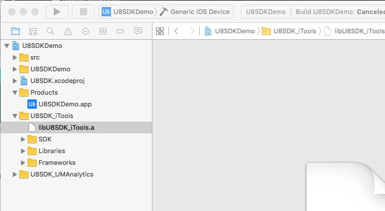
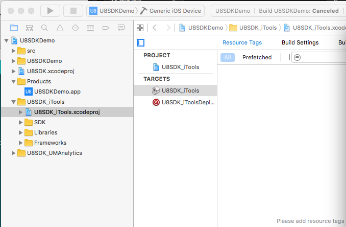
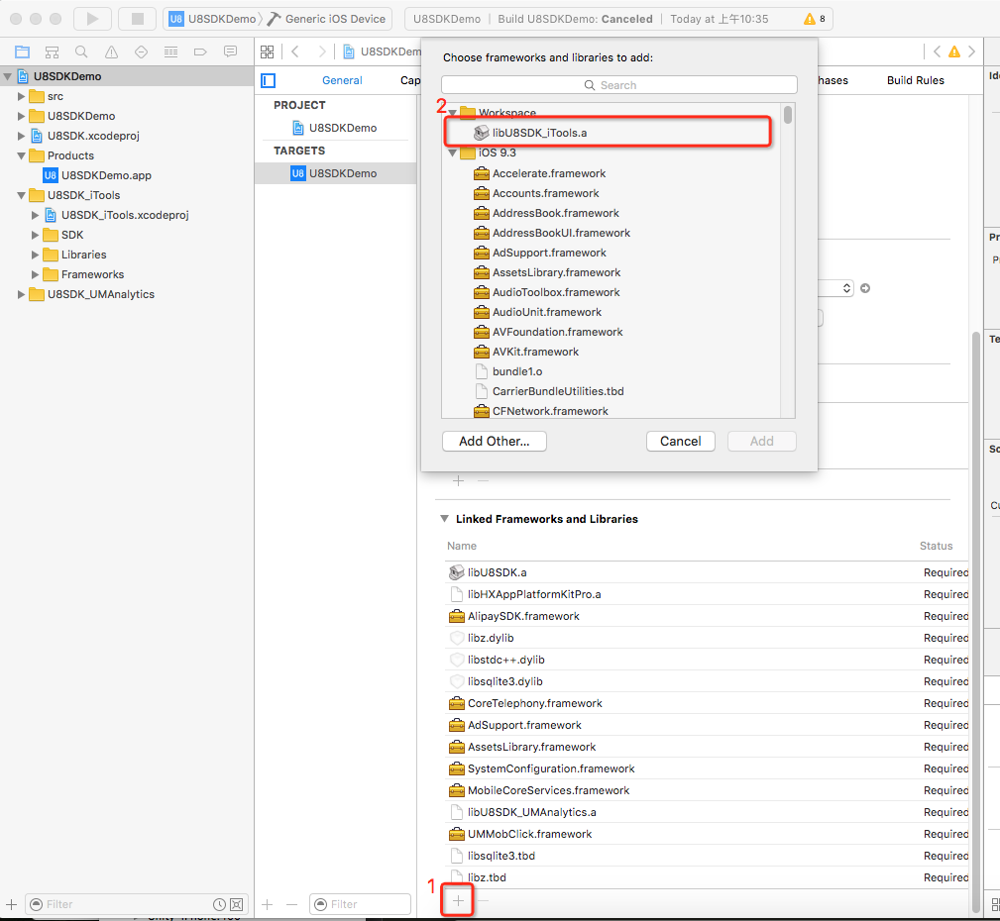

IOS插件的调试
=========

调试插件要用日志输出？no！ 正确的姿势要用xcode断点调试

插件工程是一个独立的xcode静态库项目，没办法直接运行，因此调试只能通过游戏渠道项目来进行
而u8sdk打包工具生成的渠道项目只是引用了插件静态库，因此需要把引用插件的静态库，
替换为引用插件的xcode项目。

一般情况下，由于游戏项目可能比较庞大，编译速度可能比较慢，我们建议在插件开发阶段，
使用我们提供的原生demo项目来调试，没问题了再接入正式项目联调

准备渠道项目
-------

假设， 我有个iTools插件初始化报错，我想在插件初始化函数里加个断点看看。我有个xcode项目u8test, 
通过u8sdk打包工具， 生成了一个iTools渠道项目u8test.iTools，这个渠道项目已经引用了插件的静态库，
下图中的libU8SDK_iTools.a就是iTools的静态库文件

移除插件静态库文件
-------

首先要把libU8SDK_iTools.a从渠道项目中移除，选中+delete即可

添加插件xcode项目
-------
U8SDK的插件项目都在Plugins目录下，每个插件都是个xcode项目，U8SDK_iTools就是我们要调试的iTools插件.
把U8SDK_iTools.xcodeproj从Finder中拖到渠道项目里，结果如下图

引用插件项目的静态库
-------
添加插件静态库libU8SDK_iTools.a到Linked Frameworks and Libraries中,
注意：这里添加的静态库并非之前删除的libU8SDK_iTools.a文件，实际上是引用了插件工程的target文件。

加断点调试
-------
在代码中添加断点，连真机直接run， 愉快的调试吧

调试u8sdk抽象层（libU8SDK.a)
-------

U8SDK的抽象层项目在Core目录下
如果游戏项目没有直接饮用u8sdk抽象层的xcode项目，那么如果需要调试抽象层， 那就需要把libU8SDK.a换成U8SDK.xcodeproj,
方法与替换插件静态库一样

插件没初始化？
-------

在插件的initWithParams方法中设了断点， 但是没有中断， 怎么回事？
