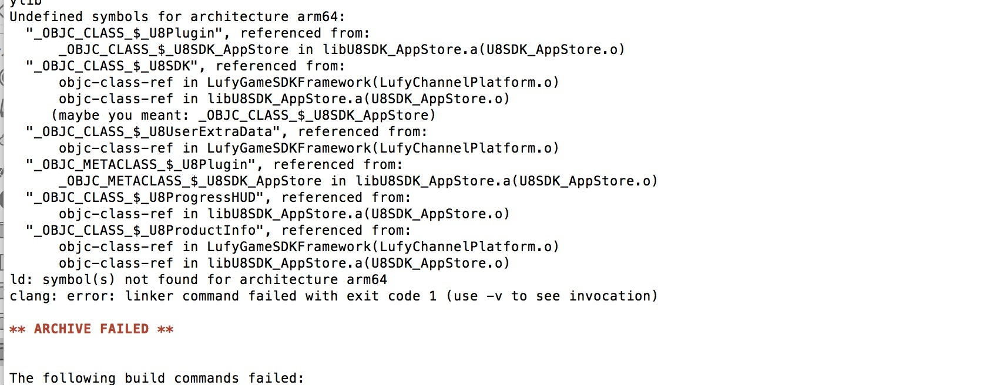
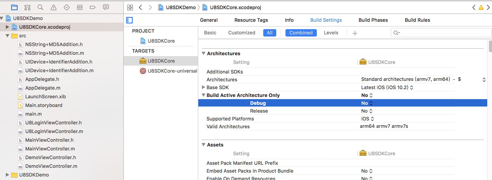

IOS常见问题
=========

Appstore
---------
**怎样提交Appstore审核？**

打包工具生成的ipa包可能是无法直接提交到appstore的，这取决于配置的provision的类型， 如果provision是AdHoc的，那么ipa包只能在已经添加到provision的设备上安装，但是仍然可以通过Archive包来上传，打开xcode的organizer，可以看到打包工具生成的Archive包，选择上传即可。

**IAP充值验证流程**

当appstore充值成功后会出发回调OnPayPaid，在回调函数中把充值订单验证数据上传到服务器，然后调用finishTransaction方法结束订单。服务器拿到订单数据后，向Appstore发送订单验证请求，确认订单有效后给用户发货。

PP助手
---------

**模拟器编译失败**

PP助手不支持模拟器环境，只能选择真机编译

**PP助手怎样自动打包**

渠道自定义脚本 xcode_process.py
``` python
def post_process(self, project, infoPlist, sdkparams):
    buildConfig = self.target.get_buildconfig("Debug")

    buildConfig['buildSettings']['ONLY_ACTIVE_ARCH'] = 'NO'
```
渠道配置文件
``` json
{
	"archs": "armv7 arm64",
    "BuildConfig": "Debug"
}
```

91助手
---------
**91助手在ios9上显示方向错误**

91助手SDK没有适配ios8以上系统，这个问题不影响审核通过，可以无视。。。

其他
---------

#### 如何修改Architectures(cpu架构)

config.json支持指定Architectures,
如果希望支持arm64和armv7:
```json
{
    "archs": "armv7 arm64"
}
```
如果希望只支持arm64:
```json
{
    "archs": "arm64"
}
```

#### xcode工程有多个target, 怎样指定要编译的target

在common/config.json里面指定
```json
{
    "target": "target名称"
}
```

#### 执行打包脚本 报错:Permission denied

需要给打包工具添加可执行权限
```
chmod +x buildscript/build.py
chmod +x buildscript/u8build
```

#### Link失败: duplicate symbol

这种链接失败通常是第三方库被重复引用导致的, 接入SDK的时候要注意:**SDK静态库不能同时编译进插件和渠道工程**

排查一下SDK的静态库有没有编译进插件, 如果有, 就删除插件工程中的引用

另外还常见以下冲突情况, 需要处理
* 同时接入多个第三方SDK的情况下, 可能存在SDK之间冲突的情况
* 第三方SDK和母工程存在冲突

#### Link失败: Undefined symbols for architecture arm64:



解决方法: 把下图的设置改为NO



#### 怎样添加optional的framework?

在xcode_process.py中添加的framework默认是required, 怎样实现使依赖类型改为optional?
可以在framework名称后面加上":weak"

``` python
mods = {
    
    "frameworks": [
    "JavaScriptCore.framework:weak"
    ],
    "libs": [
    ]
}
```

#### 没有源码直接用ipa包可以打渠道包吗？

U8SDK仅支持基于源码打包，我们以后会研究这种方式的可行性。不过我们提供了iparepacker工具，可以简单的修改ipa包，这个工具已经开源：https://github.com/uustory/iparepack

#### 编译失败, 找不到provision profile
```
error: no provisioning profile matches 'XC Ad Hoc: \*'
```
在common/config.json中修改provision字段，改为苹果开发者帐号里的provision的名字。

#### 编译失败, scheme不存在
```
xcodebuild: error: The project named "U8SDKDemo" does not contain a scheme named "U8SDKDemo". The "-list" option can be used to find the names of the schemes in the project.
```

一般是母工程的scheme名称跟target名称不一致的，需要用xcode打开母工程， 打开Manage Schemes， 重新生成Scheme
