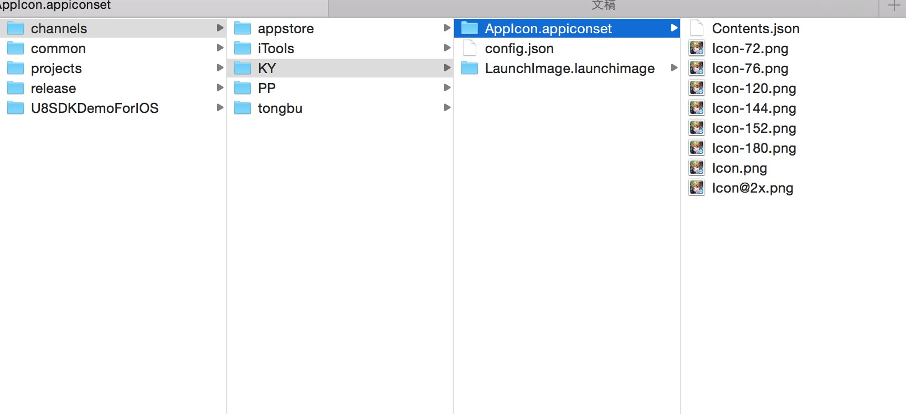
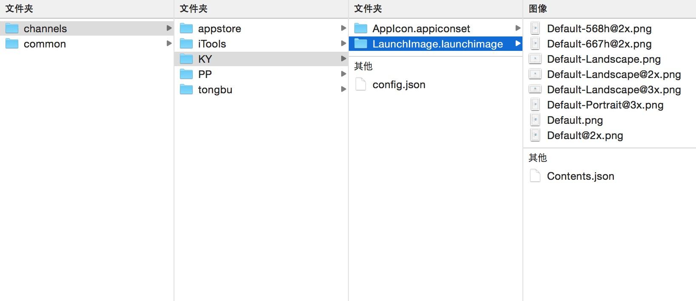

IOS渠道SDK配置
=======

配置渠道SDK参数
-------------

```
渠道参数的配置，例如，渠道分配的appID，appKey，SecretKey等参数，各个游戏都不相同，所以，我们需要将这些参数配置在各个游戏的工作目录中。

所以，我们在各个游戏的工作目录中，我们都需要建立一个channels子目录，用于存放各个渠道的参数配置，和特殊资源。比如，AAA渠道，我们在channels目录下，新建一个AAA目录，然后在这个目录中，新建一个config.json，内容如下：

{
    "desc":"AAA SDK",
    "U8SDK": {
        "Channel": 2001
    },
    "plugins": [
        {
            "name": "AAA",          //这里的名称必须和接入工程目录名称_之后的匹配。
                                    //比如我们接入工程叫U8SDK_AAA，那么这里的name就是AAA
            "appid": "1",           //在initWithParams中，我们根据这里的key解析参数
            "appkey": "58C6A68DDDEE471AA43266E427F38D92"    //在initWithParams中，我们根据这里的key解析参数
        }
    ]
}

desc：当前渠道的名称或者说明
U8SDK：和common下的config.json中的U8SDK节点的内容会合并到一起。
     ---Channel:当前渠道的渠道号
plugins:这里是配置当前渠道支持的插件，注意这里是数组，这里支持将多个插件组合在一起，比如，我们接AppStore的时候，AppStore只有一个支付功能，我们还需要接入一个登录功能，我们希望使用Facebook登录。那么，我们可以独立接入AppStore和Facebook，然后在这里，配置这两个插件
    ---name:渠道名称，渠道SDK接入工程命名规则时U8SDK_***;这里的名称，必须和***一致。比如插件工程命名为U8SDK_iTools，那么这里的name的值必须为iTools.
    ---其他渠道参数，代码中或者自定义脚本中需要的参数，都可以在这里添加，key和读取的时候，保持一致即可

```

配置ICON角标
-------------

NOTE:部分渠道没有角标要求，我们可以直接将游戏的ICON放在游戏工作目录中的common目录中，同样命名为AppIcon.appiconset，结构和下图一致。这样，没有角标需求的渠道的ICON，将默认使用这个。

```
如果渠道SDK有要求ICON加角标，那么需要让美术同学做好对应的带有角标的ICON，按照固定的方式，存放在游戏工作目录／channels下改渠道的配置目录。在名称为AppIcon.appiconset的目录下，存放对应尺寸的图片，命名格式和文件结构如下：

可以从其他渠道配置目录中，拷贝一份，然后交给美术，按照要求做好，再替换进来。

```



配置渠道SDK闪屏
-------------

NOTE:部分渠道有闪屏要求，一般我们可以在游戏工作目录中的common目录中，放上通用的闪屏文件，同样的命名为LaunchImage.launchimage，结构和下图一样。对于没有闪屏的渠道SDK，默认将使用这里的闪屏

```
各个渠道的闪屏文件，按照固定的格式，放在改游戏工作目录／channels下该渠道的配置目录。在名称为LaunchImage.launchimage的目录下，存放对应尺寸的图片，命名格式和文件结构如下图：

可以从其他渠道配置目录中，拷贝一份，然后交给美术，按照要求做好，再替换进来。

```
