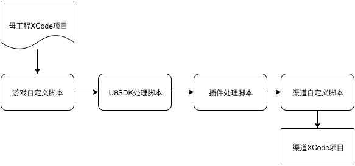

自定义脚本
==========

NOTE:接入过越狱SDK的都知道，接入一家渠道SDK，除了要编码，还要修改xcode工程配置，具体的操作一般是添加库, 资源包，修改Info.plist. 我们的自动打包脚本封装了这些基本操作，并设计了一个处理流水线，流水线的每个环节都是一个自定义的python脚本。

脚本处理流程
-------

以下是U8SDK的处理流水线




*  游戏自定义脚本，这个脚本用来处理渠道无关的修改。

*  U8SDK的处理脚本

*  插件处理脚本, 一个渠道可以加入多个插件，依次执行各个插件的处理脚本

*  渠道自定义脚本, 可以处理一些渠道的特殊需求

自定义脚本说明
-------

```
在每个渠道SDK的接入工程中，我们在根目录下，都有一个xcode_process.py。这个文件，有两部分内容：

mods = {
    "group": "U8SDK_iTools",
    "files": [
        "libU8SDK_iTools.a",
    ],
    "folders": [
        "SDK"
    ],
    "frameworks": [
        "MobileCoreServices.framework",
        "AdSupport.framework",
        "UIKit.framework"
    ],
    "libs": [
        "libsqlite3.dylib"
    ]
}

def post_process(self, project, infoPlist, sdkparams):

    self.addBundleURLType(CFBundleTypeRole="Editor", CFBundleURLSchemes=[self.getBundleId()])
    
    infoPlist['UIViewControllerBasedStatusBarAppearance'] = False


上面mods里面，是当前渠道SDK的编译参数；

下面post_process这个方法就是该渠道SDK的自定义逻辑入口，在编译xcode工程之前，修改xcode工程之后执行。

所以，一般渠道SDK都有一些特殊的需求，比如修改plist文件，增加Bundle URL Types等等。

我们都可以在自定义逻辑中，完成这些特殊需求。

```

实例1
--------

1、场景

iTools渠道SDK要求在plist文件中将UIViewControllerBasedStatusBarAppearance设置为false；同时添加一个URL Type，将Schemes设置为应用程序的Bundle Identifier

2、解决方案

这个比较适合通过自定义脚本来完成，因为我们不能直接修改母工程，来添加URL Type，和修改母工程的plist文件。

3、代码片段

```
def post_process(self, project, infoPlist, sdkparams):

    self.addBundleURLType(CFBundleTypeRole="Editor", CFBundleURLSchemes=[self.getBundleId()])
    
    infoPlist['UIViewControllerBasedStatusBarAppearance'] = False

```

实例2
--------

1、场景

快用渠道SDK要求在plist文件中将UIViewControllerBasedStatusBarAppearance设置为false；同时添加一个URL Type，Name为com.ky.xSDK.apipay，Schemes为应用程序的Bundle Identifier;

同时，我们需要将xsdkFramework.framework添加到Embedded Binaries中


2、解决方案

这个比较适合通过自定义脚本来完成，因为我们不能直接修改母工程，来添加URL Type，和修改母工程的plist文件。
添加动态framework，通过上面的mods配置，目前还无法加入，所以，我们也放在自定义脚本中完成。

3、代码片段

```
def post_process(self, project, infoPlist, sdkparams):
    self.embed_binary("SDK/xsdkFramework.framework")
    self.addBundleURLType(CFBundleURLName = "com.ky.xSDK.alipay", CFBundleTypeRole="Editor", CFBundleURLSchemes=[self.getBundleId()])
    
    infoPlist['UIViewControllerBasedStatusBarAppearance'] = False

```

API
-------

NOTE:通过上面的例子，我们看到，这个自定义脚本中，我们调用了很多self.**方法。那么，有哪些方法可以使用呢？这个文件对应的类在scripts/xcode_gen.py中的XcodeProcess类中定义的方法


```

#获取当前Bundle Identifier
def getBundleId(self):

#添加 URL Type
def addBundleURLType(self, CFBundleURLSchemes, CFBundleURLName = None, CFBundleTypeRole = "Editor"):

#合并plist文件
def updateInfoPlist(self, m):

#获取U8SDK中的通用参数
def getInfoU8SDKParams(self):

#获取当前渠道中的所有插件参数
def getInfoU8SDKPlugins(self):

#添加Embedded Binaries
def embed_binary(self, path):

#删除工程中已经添加的库或者文件
def remove_file(self, path):

```