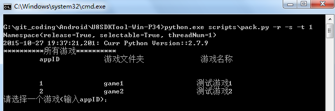
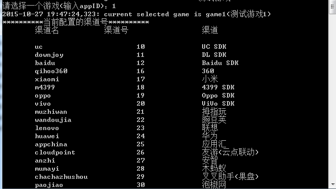
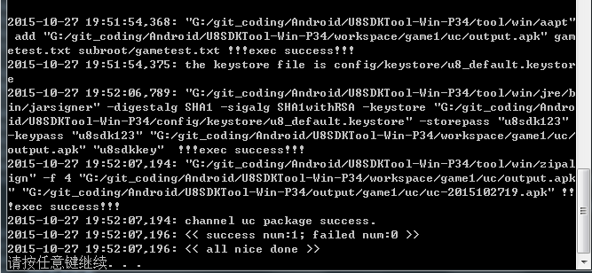

打出渠道包
===========

Android平台打包
-------

Note:Android平台的打包工具，可以在windows下和mac下进行打包。windows下打包工具根目录为U8SDKTool-Win-P34

**1、打包命令**

windows下可以运行pacakge.bat进行打包，你可以编辑这个文件看看，他其实是运行了一个python命令：

```
python scripts\pack.py -r -s -t 1
```

你也可以在cmd中直接运行这个命令进行打包，关于后面的几个参数，我们这里解释一下：

```
你也可以直接运行切到打包工具根目录，然后运行 python scripts/pack.py -h 来查看这个命令的帮助信息

 -r, --release         标记为正式包，非正式包会在包名后面加上.debug
 -s, --select          让用户自己选择需要打包的渠道。否则将会打出所有渠道包
 -t THREADNUM, --thread THREADNUM 全部打包时的打包线程数量
 --version             查看当前使用的U8SDK版本

加上-r，说明打出来的包为正式包；如果不加，打出来的包为测试包，测试包会在最终的包名上加上.debug后缀。防止测试包和正式包无法同时在同一个机子上安装的情况。

加上-s，会让你选择需要打包的渠道，不加这个，则会打出当前配置的所有渠道的渠道包

加上-t，用于打包的线程个数，这个仅仅在-s加上的情况下，才有效。

```

**2、准备母包**

Android平台的打包原理是基于apk反编译资源动态整合的方式，所谓母包，指的是：接入了U8SDK2抽象层的游戏工程打出的apk。
所以，打包之前，我们需要将母包放到打包工具中当前游戏对应的配置目录下，并命名为u8.apk[注意，名称必须是这个]

U8SDK本身就是支持多游戏的，打包工具也不例外，每个游戏在打包工具中，都有对应的配置目录。所有游戏的配置目录都统一放在
U8SDKTool-Win-P34/games/目录下

你拿到U8SDK时，这个目录里已经有两个拥有测试的游戏配置目录：game1和game2。如果你需要新建一个游戏目录，那么除了建立一个目录之外，还需要在games.xml中添加配置，这样打包工具才会识别到。

我们现在以game1为例，我们将game1的母包，放在game1/目录下，命名为u8.apk。

这样，我们的准备工作就已经完成了，接下来，我们就执行打包命令，看看其是如何打出最终的各个渠道的渠道包的吧

**3、打包过程**

母包准备好之后，就可以执行打包命令，进行打包了。如果是你是windows下，那么你直接执行打包工具根目录下的pacakge.bat即可开始打包。如果你是mac下，开启一个新的终端，进入打包工具根目录，运行python scripts/pack.py -r -s 命令进行打包。

打包之前，正如我们上面说的，u8sdk支持多游戏，所以，首先提示我们选择当前需要打包的是哪个游戏，如下图：



输入游戏对应的appID，即可继续进行。比如我们这里测试game1,我们输入1：



这里就罗列出了当前配置的所有渠道信息，可以选择需要打包的渠道，输入需要打包的渠道的渠道名，如果需要同时打出多个渠道，用英文的逗号分割，如果要打出全部渠道包，则直接输入*号。

比如我们输入uc，打出uc的渠道包。接下来，就是打包过程的日志输出了，这里输出的信息很关键，有时候打包失败，就是需要从这些日志信息中去排查异常和错误。

打包的时候，这些日志信息除了输出在控制台中，也会输出到U8SDKTool-Win-P34/log/u8sdk.log日志文件中。控制台有时候有容量的限制，看不全，可以分析u8sdk.log文件。

打包所耗费的时间，和母包的大小是相关的。如果母包在100M左右，那么一个渠道的打包时间在1分钟时间左右。打包结束后，会有成功和失败的概括信息，比如1分钟后，我们uc渠道打包成功完毕了，会看到控制台有如下信息：



这样就说明打包结束，并成功了。生成的渠道包在U8SDKTool-Win-P34/output/game1/uc目录下。其他渠道也是类似，在output/当前游戏/当前渠道/目录下，以 [渠道名-时间戳].apk 命名。直接安装这个包，进行测试吧。

NOTE:打包过程中，我们会在workspace目录下，生成临时工作目录，用于资源的临时存放，拷贝，合并，生成等操作。所以workspace下的文件，是我们排查问题的重要入口。对应的临时工作目录，在下次打包的时候，会进行清理。

**4、异常和问题分析**

有时候打包失败，或者其他异常，我们需要检查打包过程是否正确，首先，我们需要分析u8sdk.log日志文件，查找error等关键字。看看有没有一些错误。

然后，我们分析[U8SDKTool-Win-P34/workspace/当前游戏/当前渠道/]目录下生成的各种文件，大部分我们需要在decompile目录下，查看一些关键文件，包括

```
1、最终的AndroidManifest.xml文件，看看里面的数据是否完整和正确
2、smali目录下对应的一些类文件是否存在(特别是运行时，说找不到某些类时)
3、lib目录下支持的平台的so文件是否存在(特别是运行时，说找不到某个so文件)
4、assets目录下对应的资源是否存在。这里有两个特别的文件，一个是developer_config.properties,一个是plugin_config.xml。

developer_config.properties和plugin_config.xml是打包工具生成的。

developer_config.properties文件中，是渠道参数的配置，和U8SDK本身的相关配置数据。这些数据都是在代码中需要用到的；
plugin_config.xml中配置了当前渠道支持的插件。主要用来运行时，实例化对应的登录和支付对象。

这两个文件，也是检查的重点对象，看看最终生成的文件中，数据是否完整和正确。

```

iOS平台打包
-------
待续
