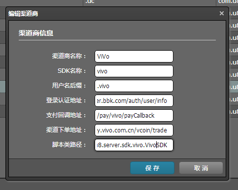
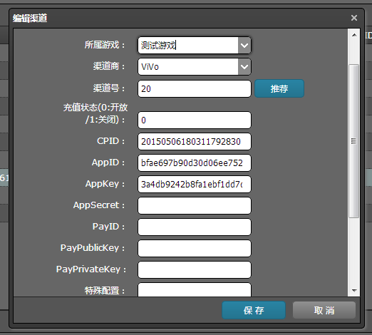

U8Server 接入新渠道
==========

NOTE:接入一个新渠道SDK，除了客户端代码版本的实现，还需要实现其服务器端部分。其中，一般包括两部分，登录认证协议和支付回调通知协议。部分渠道SDK，还需要实现其服务器端下单协议。

渠道SDK接入服务器端部分，总体来说，就两个部分：登录认证和支付回调。登录认证入口是com.u8.server.web.user.UserAction类中的UserAction中的getToken协议。客户端SDK登录成功之后，由U8SDK抽象层自动去打包工具中指定的u8server地址发起登录认证请求，访问的就是该getToken协议。首次登录认证成功之后，将会生成一条uuser用户数据。这个数据中sdkUserID将会对应该渠道SDK的用户唯一ID。

getToken协议方法中，会根据传入的渠道号，从数据库中取出当前渠道SDK的脚本类路径(一个java类文件)，然后通过反射完成实例化，并执行里面该渠道的登录认证接口。

每个渠道SDK处理登录认证的脚本类，在com.u8.server.sdk目录下，每个渠道SDK一个子目录。每个子目录下，建立一个处理类，该类需要实现com.u8.server.sdk.ISDKScript接口。

`````
public interface ISDKScript {

    public void verify(UChannel channel, String extension, ISDKVerifyListener callback);

    public void onGetOrderID(UUser user, UOrder order, ISDKOrderListener callback);

}

1、verify接口中，实现该渠道SDK的登录认证逻辑，登录成功触发callback.onSuccess回调。登录失败，触发callback.onFailed回调
2、onGetOrderID接口中，实现下单时，该渠道SDK的特有逻辑。 比如部分渠道SDK，需要支付之前，服务器端去SDK服务器端下单。 对应逻辑就写在该接口中。
`````


支付回调处理，每个渠道SDK一个类处理文件。所有渠道SDK的支付回调处理类都位于com.u8.server.web.pay.sdk目录下。

支付回调处理类的实现步骤都大同小异：

1、解析参数
2、参数校验和签名验证
3、修改订单状态，通知游戏服务器给玩家发游戏币
4、给渠道SDK服务器一个反馈（成功/失败）

以一个demo为例。

``````
@Controller
@Namespace("/pay/demo")
public class DemoPayCallbackAction extends UActionSupport {

    @Autowired
    private UOrderManager orderManager;

    @Autowired
    private UChannelManager channelManager;

    private String extOrderID;
    private String sign;
    private String rmb;


    @Action("payCallback")
    public void payCallback(){

        try{

            long orderID = Long.parseLong(extOrderID);
            UOrder order = orderManager.getOrder(orderID);

            if(order == null){
                Log.d("The order is null %s.", orderID);
                this.renderState(false);
                return;
            }

            if(order.getState() > PayState.STATE_PAYING){
                Log.d("The state of the order is complete. The state is " + order.getState());
                this.renderState(true);
                return;
            }

            UChannel channel = channelManager.getChannel(order.getChannelID());
            if(channel == null){
                Log.e("pay callback error. channel is not exists:"+order.getChannelID());
                renderState(false);
                return;
            }

            if(!isSignOK(channel)){
                Log.e("pay callback error. sign not matched. sign:%s",sign);
                renderState(false);
                return;
            }

            int moneyInt = Float.valueOf(rmb).intValue() * 100;
            if(order.getMoney() > moneyInt){
                Log.e("订单金额不一致! local orderID:"+orderID+"; money returned:"+moneyInt+"; order money:"+order.getMoney());
                this.renderState(false);
                return;
            }

            order.setRealMoney(moneyInt);
            order.setSdkOrderTime("");
            order.setCompleteTime(new Date());
            order.setChannelOrderID(extOrderID);
            order.setState(PayState.STATE_SUC);

            orderManager.saveOrder(order);

            SendAgent.sendCallbackToServer(this.orderManager, order);


            renderState(true);


        }catch (Exception e){
            e.printStackTrace();
            try{
                this.renderState(false);
            }catch (Exception e2){
                e2.printStackTrace();
                Log.e(e2.getMessage());
            }

            Log.e(e.getMessage());

        }

    }

    private boolean isSignOK(UChannel channel){

        StringBuilder sb = new StringBuilder();

        sb.append("");  //TODO:hero to generate sign source str

        Log.d("sign str is %s", sb.toString());
        String md5Local = EncryptUtils.md5(sb.toString());
        Log.d("md5 local :%s", md5Local);
        return md5Local.equals(this.sign);

    }

    private void renderState(boolean suc) throws IOException {

        String result = "";
        if(suc){

        }else{

        }

        renderText(result);
    }

    public String getRmb() {
        return rmb;
    }

    public void setRmb(String rmb) {
        this.rmb = rmb;
    }

    public String getSign() {
        return sign;
    }

    public void setSign(String sign) {
        this.sign = sign;
    }

    public String getExtOrderID() {
        return extOrderID;
    }

    public void setExtOrderID(String extOrderID) {
        this.extOrderID = extOrderID;
    }
}

1、@Namespace("/pay/demo") 该注解，指定该渠道SDK的支付回调处理地址的相对路径。 注意： 必须以【/pay/渠道SDK标识】命名。
2、@Action("payCallback") 里面的处理方法，统一以该名称命名。
3、isSignOK 方法中，进行签名校验
4、处理成功，调用SendAgent.sendCallbackToServer(this.orderManager, order);方法通知游戏服务器给玩家发货。
5、renderState方法中，给渠道SDK反馈成功或者失败。

``````

假设我们现在接入一个新渠道SDK——vivo， 服务器端需要实现登录认证协议和支付回调协议。同时，支付之前还需要去他的SDK服务器端下单，并将下单的结果，返回给客户端。


登录认证
---------
通过看vivo的文档，我们得知，vivo的登录认证需要使用http post请求其登录认证地址，将客户端SDK登录成功获取到的token进行验证。

1、建立渠道SDK脚本子目录和脚本类

在com.u8.server.sdk下面，新建一个包名：vivo。 然后在com.u8.server.sdk.vivo包名下，建立一个VivoSDK脚本类。类内容如下：
``````
public class VivoSDK implements ISDKScript{
    @Override
    public void verify(final UChannel channel, String extension, final ISDKVerifyListener callback) {

        
    }

    @Override
    public void onGetOrderID(UUser user, UOrder order, ISDKOrderListener callback) {

    }
}

``````

2、从extension中，解析需要的参数。

登录认证协议这里， 是去验证客户端获取到的SDK的参数。客户端登录成功，每个渠道SDK返回的参数都是不同的。所以登录认证的时候，我们将该渠道SDK需要的参数，按照一定的格式组合，最终生成一个字符串，传到u8server。 这里我们的规则，一般是：一个参数直接传；多个参数，用json格式。这个参数，传到u8server这边，就对应verify接口中的extension字段了。

NOTE:Android客户端接入渠道SDK，登录成功触发U8SDK.getInstance().onLoginResult(String ext)方法时，传入的ext就会完整的对应服务器端这里的extension。iOS接入新渠道，登录成功触发[self eventUserLogin:data];方法时，传入的data也会完整的对应这里的extension。

这里参数的格式，服务器端同学和客户端接入的同学协商好。多个字段json格式，各个字段的key是什么。可以服务器端来指定，也可以客户端来指定。

VivoSDK这里，需要三个参数，客户端登录成功，获取到的openid，name和token。以json格式封装。

``````
JSONObject json = JSONObject.fromObject(extension);
final String openid = json.getString("openid");
final String name = json.getString("name");
final String token = json.getString("token");
``````

解析参数之后，我们根据vivo 服务器端文档中登录认证协议，进行http post请求。 访问http请求， 我们已经封装好了接口。直接调用UHttpAgent.getInstance().post或者UHttpAgent.getInstance().get方法进行post或者get方式的请求。

参数默认是application/x-www-form-urlencoded类型，可以直接将参数放到Map<String,String>中传入。

如果渠道SDK要求参数按照application/json格式传入，那么需要设置对应的请求头和参数传入方式，比如：

``````
            String jsonData = JsonUtils.encodeJson(params);


            Map<String,String> headers = new HashMap<String, String>();
            headers.put("Content-Type", "application/json");

            httpClient.post(channel.getChannelAuthUrl(), headers, new ByteArrayEntity(jsonData.getBytes(Charset.forName("UTF-8"))), new UHttpFutureCallback() {
            	//......
            });
``````

vivo sdk这里参数是按照application/x-www-form-urlencoded方式进行传递：

``````
    public void verify(final UChannel channel, String extension, final ISDKVerifyListener callback) {

        try{

            extension = extension.replace("\n", "%0A");//替换回车符，vivo子帐号登录成功返回的token多了回车，导致解析json出错。@小抛同学发现

            JSONObject json = JSONObject.fromObject(extension);
            final String openid = json.getString("openid");
            final String name = json.getString("name");
            final String token = json.getString("token");

            Map<String, String> params = new HashMap<String, String>();
            params.put("access_token", token);

            UHttpAgent.getInstance().post(channel.getChannelAuthUrl(), params, new UHttpFutureCallback() {
                @Override
                public void completed(String content) {

                    Log.e("The auth result is "+content);
                    try{

                        AuthInfo authInfo = (AuthInfo)JsonUtils.decodeJson(content, AuthInfo.class);
                        if(authInfo != null && authInfo.getUid().equals(openid)){
                            callback.onSuccess(new SDKVerifyResult(true, openid, name, ""));
                            return;
                        }

                    }catch (Exception e){
                        e.printStackTrace();
                    }

                    callback.onFailed(channel.getMaster().getSdkName() + " verify failed. the post result is " + content);

                }

                @Override
                public void failed(String e) {
                    callback.onFailed(channel.getMaster().getSdkName() + " verify failed. " + e);
                }

            });

        }catch (Exception e){
            e.printStackTrace();
            callback.onFailed(channel.getMaster().getSdkName() + " verify execute failed. the exception is "+e.getMessage());
        }
    }

    1、post请求成功之后，我们从content中解析返回的数据。并验证登录认证协议结果是否正确。如果正确，我们触发callback.onSuccess()回调
    2、失败的情况，我们触发callback.onFailed回调。
    3、new SDKVerifyResult(true, openid, name, "")。 该成功回调的用户对象，有四个参数。第一个固定为true。第二个为渠道SDK用户唯一ID(必须传入)，第三个为渠道SDK用户名(没有则传入空字符串)，第四个一般传入""
    4、登录认证url地址，是在后台管理中，渠道商里面配置。 这里我们直接通过 channel.getChannelAuthUrl()接口获取。 怎么配置，在下面会讲到。

``````

有些时候，部分小渠道可能没有登录认证这一步。那我们怎么做呢？

对于没有登录认证协议的渠道SDK，我们依然要写登录认证逻辑。 让客户端传入渠道SDK用户唯一ID，然后进行回调callback.onSuccess接口。

``````
    @Override
    public void verify(final UChannel channel, String extension, final ISDKVerifyListener callback) {


        try{

            JSONObject json = JSONObject.fromObject(extension);
            final String uid = json.getString("uid");
            String username = "";
            if(json.containsKey("username")){
                username = json.getString("username");
            }

            String nickname = "";
            if(json.containsKey("nickname")){
                nickname = json.getString("nickname");
            }

            //夜神SDK 现在没有服务器端登录认证接口，这里直接绑定
            callback.onSuccess(new SDKVerifyResult(true, uid, username, nickname));


        }catch (Exception e){
            callback.onFailed(channel.getMaster().getSdkName() + " verify execute failed. the exception is "+e.getMessage());
            Log.e(e.getMessage());
        }

    }


``````


支付回调
---------
渠道SDK支付回调，是SDK支付成功之后， 渠道SDK服务器会异步发送一个http请求到指定的处理接口。每个渠道SDK的支付回调处理类，在com.u8.server.web.pay.sdk包名下。

1、所有支付回调类的命名以PayCallbackAction结尾，当然只是一个约定，并不是强制。
2、所有渠道SDK支付回调地址的相对url，是/pay/渠道SDK标识/payCallback。 这里对应@Namespace注解和@Action注解中字符串的结合。比如下面vivo这里，支付回调相对地址就是： /pay/vivo/payCallback。这个相对地址，回头也需要在后台管理系统-》渠道商管理中配置。
3、支付回调协议中，需要根据渠道SDK文档中的参数说明进行解析。
4、客户端调用渠道SDK的支付接口时，需要将PayParams中的orderID放到渠道SDK异步通知会原样返回u8server的某个字段。u8server支付回调处理类中，从该参数中读取出订单号，并从数据库中查出订单信息。

有些渠道SDK回调协议中Content-Type是application/x-www-form-urlencoded类型。 这种参数的解析，你只需要在类中定义好对应的变量，别生成getter,setter方法。请求过来之后，struts框架会自动解析这些参数并将其赋值到对应的变量中。

有些渠道SDK回调协议中Content-Type，可能是application/json或者text/xml等。 这些方式，直接通过上面的方式无法进行解析。这个时候，需要我们自己从http的request对象中解析content字符串内容。然后按照json或者xml格式进行解析。

比如：
``````
            BufferedReader br = this.request.getReader();
            String line;
            StringBuilder sb = new StringBuilder();
            while((line=br.readLine()) != null){
                sb.append(line);
            }

            String urlData = URLDecoder.decode(sb.toString(), "utf-8");
            PayCallback rsp = (PayCallback) JsonUtils.decodeJson(urlData, PayCallback.class);
``````


还是以vivo sdk为例，这里他的Content-Type为application/x-www-form-urlencoded，所以，我们直接定义协议变量，生成get,set方法就可以了。

``````
@Controller
@Namespace("/pay/vivo")
public class VivoPayCallbackAction extends UActionSupport{

    private String respCode		;					//响应码	200
    private String respMsg		;					//响应信息	交易完成
    private String signMethod	;					//签名方法	对关键信息进行签名的算法名称：MD5
    private String signature	;					//签名信息	对关键信息签名后得到的字符串1，用于商户验签签名规则请参考附录 2.6.3 消息签名
    private String tradeType	;					//交易种类	目前固定01
    private String tradeStatus	;					//交易状态	0000，代表支付成功
    private String cpId			;					//Cp-id	定长20位数字，由vivo分发的唯一识别码
    private String appId		;					//appId	应用ID
    private String uid			;					//用户在vivo这边的唯一标识
    private String cpOrderNumber;					//商户自定义的订单号	商户自定义，最长 64 位字母、数字和下划线组成
    private String orderNumber	;					//交易流水号	vivo订单号
    private String orderAmount	;					//交易金额	单位：分，币种：人民币，为长整型，如：101，10000
    private String extInfo		;					//商户透传参数	64位
    private String payTime		;					//交易时间	yyyyMMddHHmmss

    @Autowired
    private UOrderManager orderManager;

    @Autowired
    private UChannelManager channelManager;

    @Action("payCallback")
    public void payCallback(){
        try{

            long orderID = Long.parseLong(cpOrderNumber);

            UOrder order = orderManager.getOrder(orderID);

            if(order == null ){
                Log.d("The order is null %s.", orderID);
                this.renderState(false, "notifyId 错误");
                return;
            }

            if(order.getState() > PayState.STATE_PAYING){
                Log.d("The state of the order is complete. The state is "+order.getState());
                this.renderState(false, "该订单已经被处理,或者CP订单号重复");
                return;
            }

            UChannel channel = channelManager.getChannel(order.getChannelID());
            if(channel == null){
                Log.d("The channel is not exists of channelID:"+order.getChannelID());
                this.renderState(false, "渠道不存在");
                return;
            }

            if(this.respCode.equals("200") && this.tradeStatus.equals("0000")){
                if(isValid(channel)){
                    order.setRealMoney(Integer.valueOf(orderAmount));
                    order.setSdkOrderTime(payTime);
                    order.setCompleteTime(new Date());
                    order.setChannelOrderID(orderNumber);
                    order.setState(PayState.STATE_SUC);
                    orderManager.saveOrder(order);
                    SendAgent.sendCallbackToServer(this.orderManager, order);
                    this.renderState(true, "");
                }else{
                    order.setChannelOrderID(orderNumber);
                    order.setState(PayState.STATE_FAILED);
                    orderManager.saveOrder(order);
                    this.renderState(false, "sign 错误");
                }
            }else{

                this.renderState(false, "支付失败");
            }

        }catch (Exception e){
            e.printStackTrace();
            try {
                this.renderState(false, "未知错误");
            } catch (IOException e1) {
                e1.printStackTrace();
            }
        }
    }

    private boolean isValid(UChannel channel){

        StringBuilder sb = new StringBuilder();
        sb.append("appId=").append(appId).append("&")
                .append("cpId=").append(channel.getCpID()).append("&")
                .append("cpOrderNumber=").append(cpOrderNumber).append("&");

        if(!TextUtils.isEmpty(extInfo)){
            sb.append("extInfo=").append(extInfo).append("&");
        }

        sb.append("orderAmount=").append(orderAmount).append("&")
                .append("orderNumber=").append(orderNumber).append("&")
                .append("payTime=").append(payTime).append("&")
                .append("respCode=").append(respCode).append("&");

        if(!TextUtils.isEmpty(respMsg)){
            sb.append("respMsg=").append(respMsg).append("&");
        }

        sb.append("tradeStatus=").append(tradeStatus).append("&")
                .append("tradeType=").append(tradeType).append("&")
                .append("uid=").append(uid).append("&");

        sb.append(EncryptUtils.md5(channel.getCpAppKey()).toLowerCase());

        String vCode = EncryptUtils.md5(sb.toString()).toLowerCase();

        return vCode.equals(this.signature);

    }

    private void renderState(boolean suc, String msg) throws IOException {

          if(suc){
              super.renderText("success");
          }else{
              super.renderText("fail");
          }


    }

    public String getRespCode() {
        return respCode;
    }

    public void setRespCode(String respCode) {
        this.respCode = respCode;
    }

    public String getRespMsg() {
        return respMsg;
    }

    public void setRespMsg(String respMsg) {
        this.respMsg = respMsg;
    }

    public String getSignMethod() {
        return signMethod;
    }

    public void setSignMethod(String signMethod) {
        this.signMethod = signMethod;
    }

    public String getSignature() {
        return signature;
    }

    public void setSignature(String signature) {
        this.signature = signature;
    }

    public String getTradeType() {
        return tradeType;
    }

    public void setTradeType(String tradeType) {
        this.tradeType = tradeType;
    }

    public String getTradeStatus() {
        return tradeStatus;
    }

    public void setTradeStatus(String tradeStatus) {
        this.tradeStatus = tradeStatus;
    }

    public String getCpId() {
        return cpId;
    }

    public void setCpId(String cpId) {
        this.cpId = cpId;
    }

    public String getAppId() {
        return appId;
    }

    public void setAppId(String appId) {
        this.appId = appId;
    }

    public String getUid() {
        return uid;
    }

    public void setUid(String uid) {
        this.uid = uid;
    }

    public String getCpOrderNumber() {
        return cpOrderNumber;
    }

    public void setCpOrderNumber(String cpOrderNumber) {
        this.cpOrderNumber = cpOrderNumber;
    }

    public String getOrderNumber() {
        return orderNumber;
    }

    public void setOrderNumber(String orderNumber) {
        this.orderNumber = orderNumber;
    }

    public String getOrderAmount() {
        return orderAmount;
    }

    public void setOrderAmount(String orderAmount) {
        this.orderAmount = orderAmount;
    }

    public String getExtInfo() {
        return extInfo;
    }

    public void setExtInfo(String extInfo) {
        this.extInfo = extInfo;
    }

    public String getPayTime() {
        return payTime;
    }

    public void setPayTime(String payTime) {
        this.payTime = payTime;
    }
}

``````


下单特殊逻辑
---------

u8sdk支付流程中，客户端调用SDK支付接口之前，会来u8server做一个下单的请求，对应U8Server中com.u8.server.web.pay.PayAction类中的getOrder协议。下单这一步操作， 主要两个目的：

1、生成一个uorder订单记录，状态为支付中，获取一个u8server这边的订单号，返回给客户端。客户端传入渠道SDK，SDK支付成功异步回调的时候，我们根据该订单号，从数据库中取出订单数据。

2、执行渠道SDK特有逻辑。比如vivo 渠道SDK，支付之前，需要服务器端去vivo sdk服务器端下单，并将下单返回的transNo和accessKey字段返回给客户端。客户端在调用支付接口的时候，需要传入这两个参数。

3、还有一些渠道SDK的支付回调地址，是通过客户端调用支付接口时传入的。为了避免将渠道SDK支付回调地址写死在客户端，不利于后面修改。我们将有该需求的渠道SDK的支付回调地址，也通过渠道SDK特有逻辑返回给客户端。

4、下单特有逻辑，写在渠道SDK脚本类的onGetOrderID接口中。

我们以vivo sdk为例， 看看其逻辑。

`````
    @Override
    public void onGetOrderID(UUser user, UOrder order, ISDKOrderListener callback) {
        if(callback != null){

            try{

                UChannel channel = order.getChannel();
                if(channel == null){
                    Log.e("The channel is not exists of order "+order.getOrderID());
                    return;
                }

                String orderUrl = channel.getChannelOrderUrl();

                Log.d("the order url is "+orderUrl);
                Log.d("CPID:"+order.getChannel().getCpID());
                Log.d("appID:"+order.getChannel().getCpAppID());
                Log.d("appKey:"+order.getChannel().getCpAppKey());

                String version = "1.0.0";
                String signMethod = "MD5";
                String signature = "";
                String cpId = order.getChannel().getCpID();
                String appId = order.getChannel().getCpAppID();
                String cpOrderNumber = ""+order.getOrderID();
                String notifyUrl = channel.getPayCallbackUrl();
                String orderTime = TimeUtils.format_yyyyMMddHHmmss(order.getCreatedTime());
                String orderAmount = order.getMoney() + "";
                String orderTitle = order.getProductName();
                String orderDesc = order.getProductDesc();
                String extInfo = order.getOrderID()+"";        //空字符串不参与签名

                StringBuilder sb = new StringBuilder();
                sb.append("appId=").append(appId).append("&")
                .append("cpId=").append(cpId).append("&")
                .append("cpOrderNumber=").append(cpOrderNumber).append("&")
                .append("extInfo=").append(extInfo).append("&")
                .append("notifyUrl=").append(notifyUrl).append("&")
                .append("orderAmount=").append(orderAmount).append("&")
                .append("orderDesc=").append(orderDesc).append("&")
                .append("orderTime=").append(orderTime).append("&")
                .append("orderTitle=").append(orderTitle).append("&")
                .append("version=").append(version).append("&")
                .append(EncryptUtils.md5(channel.getCpAppKey()).toLowerCase());

                signature = EncryptUtils.md5(sb.toString()).toLowerCase();

                Map<String,String> params = new HashMap<String, String>();
                params.put("version", version);
                params.put("signMethod", signMethod);
                params.put("signature", signature);
                params.put("cpId", cpId);
                params.put("appId", appId);
                params.put("cpOrderNumber", cpOrderNumber);
                params.put("notifyUrl", notifyUrl);
                params.put("orderTime", orderTime);
                params.put("orderAmount", orderAmount);
                params.put("orderTitle", orderTitle);
                params.put("orderDesc", orderDesc);
                params.put("extInfo", extInfo);

                String result = UHttpAgent.getInstance().post(orderUrl, params);

                Log.e("The vivo order result is "+result);

                VivoOrderResult orderResult = (VivoOrderResult)JsonUtils.decodeJson(result, VivoOrderResult.class);
                if(orderResult != null && orderResult.getRespCode() == 200){

                    JSONObject ext = new JSONObject();
                    ext.put("transNo", orderResult.getOrderNumber());
                    ext.put("accessKey", orderResult.getAccessKey());
                    String extStr = ext.toString();
                    callback.onSuccess(extStr);

                }else{

                    callback.onFailed("the vivo order result is "+result);

                }

            }catch (Exception e){
                e.printStackTrace();
                callback.onFailed(e.getMessage());
            }


        }
    }

    1、对于有下单需求的渠道SDK， 需要在后台管理系统-》渠道商管理中配置渠道下单地址。代码中，通过channel.getChannelOrderUrl();接口获取
    2、处理成功，我们触发callback.onSuccess接口。我们需要将客户端需要的参数，封装成一个string类型传入。 如果有多个参数，一般以json格式封装。单个参数，直接传入。
    3、这个参数，对应下单成功，返回给客户端协议中的extension字段。 客户端渠道SDK工程中，通过PayParams的getExtension()接口获取该值。并按照和服务器端的约定，进行参数的解析。

`````

大部分渠道SDK下单特有逻辑没有，那么我们直接在这个方法中，这样就可以了：

``````
    @Override
    public void onGetOrderID(UUser user, UOrder order, ISDKOrderListener callback) {
        if(callback != null){
            callback.onSuccess("");
        }
    }
``````

还有部分渠道SDK，需要将渠道SDK的支付回调url地址通过支付接口传入SDK中。那么我们也一样通过这个方法来返回：

``````
    @Override
    public void onGetOrderID(UUser user, UOrder order, ISDKOrderListener callback) {
        if(callback != null){
            callback.onSuccess(user.getChannel().getPayCallbackUrl());
        }
    }

    1、通过user.getChannel().getPayCallbackUrl()获取到的就是完整的渠道SDK支付回调地址。 根域名或者ip需要配置在jdbc.properties文件中的u8server.base_url上

``````


后台管理系统添加配置
---------

通过上面的步骤，该渠道SDK的登录认证和支付回调逻辑，我们都已经实现了。接下来，我们需要去u8server后台进行配置。以下几点须知：

1、渠道商管理中，添加一条渠道商信息。 渠道商里面主要配置该渠道SDK登录认证地址，下单地址，支付回调相对地址，以及该渠道SDK登录认证处理类脚本类的完整路径等信息。

2、渠道管理中，添加一条渠道信息。配置该渠道所属的游戏，所属的渠道商，以及登录认证和支付回调中需要用到的渠道参数。

3、渠道商和渠道的关系，这里注意下。 比如百度这个渠道， 渠道商就一个，即百度。但是每个游戏都会有一个对应的渠道。也就是A和B两款游戏，对应渠道管理中两条渠道记录。他们所属的渠道商都是百度。但是他们所属的游戏是A和B。

4、登录认证和支付回调中，有时候需要用到渠道参数，进行签名或者签名验证。渠道参数配置在，渠道管理中该渠道的cpID,cpAppID,cpAppKey,cpPayID,cpPayPrivateKey,cpPayKey等几个字段中。这几个参数字段，可以理解为参数1，参数2，参数3...。 所以，比如vivo的渠道，你如果将appkey配置到cpAppKey字段中，那么代码中，你需要用到appkey时，只需要调用channel.getCpAppKey()接口来获取。同理，你如果配置到cpPayID字段中，那么就调用channel.getCpPayID()接口来获取。

上面vivo sdk中，我们登录后台管理系统，在渠道商管理中，新增一个渠道参数：



| 参数名称        | 参数说明          | 
|:------------- |:-------------|
| 渠道商名称     |渠道商名称|
| SDK名称| 使用的SDK名称，和客户端打包工具中配置的渠道SDK目录名一致。| 
| 用户名后缀| 首次登录认证成功之后，生成一条uuser记录，会生成一个用户名，这个用户名会加这里指定的后缀| 
| 登录认证地址 | 当前渠道SDK的登录认证url地址，没有的话，配置none | 
| 支付回调地址| 支付回调相对路径，/pay/***/payCallback | 
| 渠道下单地址| 当前渠道SDK的下单地址，没有的话，配置none | 
| 脚本类路径| 登录认证脚本类的完整路径，比如com.u8.server.sdk.vivo.VivoSDK | 


然后，我们在渠道管理中，添加一个新渠道：



| 参数名称        | 参数说明          | 
|:------------- |:-------------|
| 所属游戏     |选择所属游戏，如果当前游戏不存在，需要去游戏管理中，创建一个新游戏|
| 渠道商| 选择该渠道所属的渠道商，如果是刚刚添加的，选择列表中请拉到最后| 
| 渠道号| 渠道号是全局唯一的，不同游戏的不同渠道，渠道号也是不能重复的。渠道号和客户端打包工具配置的渠道号要一致|
| 充值状态| 是否开启充值，0:开放；1：关闭 | 
| CPID---PayPrivateKey| 渠道参数配置字段，可以理解为参数1，参数2，参数3... 配置在哪个字段，代码中就以channel.getCp**接口来获取对应的参数 | 
| 特殊配置| 部分渠道SDK需要配置一些特殊参数，比如应用宝需要配置充值比例，可以将该参数配置在这里 | 
| 下面几个参数| 其他参数默认不用配置，配置了会覆盖渠道商中对应的参数配置。 | 


至此，渠道SDK的服务器端接入就完成了。接入的时候，可以多看看其他渠道SDK的是实现方式。已经支持的渠道SDK，几乎已经遇到了各种情况的处理。可以说，99%的问题都已经有现成的案例了。所以，当你在接入新渠道SDK的时候，遇到不太清楚或者犹豫不决的地方，可以参考下其他渠道SDK的实现。


