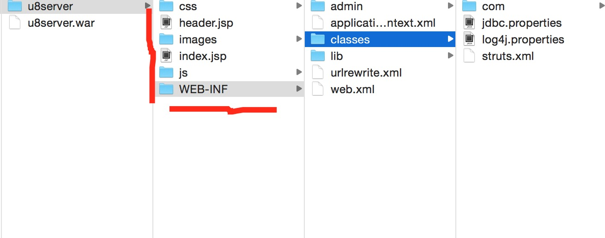

U8Server部署
=========

NOTE:U8Server采用java web标准框架J2EE开发，所以，理论上，任何能够部署java web应用程序的Web容器都可以用来部署U8Server，比如Tomcat、JBoss、WebLogic等。我们这里，仅仅演示在最有名的Tomcat中部署U8Server。其他的，原理都是类似的。

使用Tomcat的话，建议使用Tomcat7，Tomcat7要求使用jdk1.7以上版本

编码设置
---------

U8Server中，从数据库，到代码，到配置文件，所有都使用utf8编码格式， 为了http协议解析也使用utf8编码，我们需要将Tomcat的编码格式设置为utf8

Tomcat安装目录conf/server.xml文件中，找到相应的端口(默认是8080)的Connector的配置项。加上一个URIEncoding="UTF-8"，协议提交的数据编码格式就是utf8了

配置之后，这条配置如下：

```
    <Connector port="8000" protocol="HTTP/1.1" 
               connectionTimeout="20000" 
               redirectPort="8443" 
               URIEncoding="UTF-8"/>
```


预备知识
---------

1、java web可部署的目录结构：

部署java web项目，就是将工程编译后的java代码(class文件)，依赖的jar包，以及jsp，css，js，图片等资源按照指定的目录结构进行存放，然后拷贝到具体的Web容器中的部署目录，然后可能还需要根据不同Web容器的部署要求，做一些配置

java web项目的部署目录结构如下：


```
1、u8server目录下，就是当前部署项目的根目录，里面包含了css，js，WEB-INF等子目录，这些子目录，除了WEB-INF是固定的意外，其他都是可以自定义自己命名的。你也可以添加更多的子目录
2、WEB－INFO目录，是固定的目录，里面包含classes、lib等子目录，以及web.xml这个java web项目的配置文件。其他目录比如admin是自定义的，里面主要放了后台管理的一些jsp文件。
3、WEB－INFO下classes子目录，里面主要放项目编译后的class文件。这里也放了struts2和jdbc数据库链接的配置
4、WEB－INFO下lib子目录，里面主要放项目的依赖jar包
```

2、war部署方式：

除了可以将web目录直接部署到web容器中，我们也可以在编辑器中将web工程编译直接生成一个war文件， 比如上面截图中的u8server.war文件
一般Web容器中，都支持直接部署war文件。war文件，就是一个压缩包，你可以通过解压工具解压看看，里面的目录结构和上面是一样的。

3、Web容器和Java Web项目：

Java Web项目简单说，就是符合j2ee规范的java应用程序，java应用程序本身就是跨平台的，你可以运行在windows，linux，mac等机器上
Web容器简单说，就是给java web应用程序提供了一个运行环境，使得一个或者多个java web程序可以正常运行，并提供web服务。
比如，linux下部署，你首先需要下载安装一个linux版本的tomcat，然后将war文件或者web目录直接按照tomcat的部署方式进行部署就可以了。

部署教程
---------

1、根据视频教程([U8Server视频教程](http://www.chuanke.com/2869716-164072.html))搭建U8Server开发环境
2、开发环境搭建好之后， 编译运行，会在U8Server工程目录下的build目录下，生成可部署的文件或者目录，一般根据设置，会有war文件或者可以部署的目录结构
3、在build目录下找到u8server.war文件，拷贝到tomcat安装目录/webapps子目录中
4、启动tomcat，默认情况下，tomcat监听的端口是8080,然后启动浏览器，访问http：//localhost:8080/u8server/admin/login， 看看是否能够看到u8server的后台管理系统
5、因为直接把u8server扔进去之后，他默认会解压war包，生成一个u8server的子目录，如果希望访问连接中，不用加u8server，可以修改下tomcat的conf/sever.xml文件，在<Host></Host>中，增加一个配置：

<Context path="/" docBase="u8server.war" debug="0" privileged="true"/>

这个配置的path指的是根目录，docBase指的是war名

这样之后，重启tomcat，启动浏览器，直接就可以这样访问了：http：//localhost:8080/admin/login


域名设置
---------
要在外网环境中部署u8server时，我们可以给tomcat绑定一个域名，这样地址你就可以使用域名来访问，比如：
http：//www.u8sdk.com/u8server/admin/index.后面如果需要换机子部署的话，只要域名不变化，就不用做什么变动。 如果你直接用IP地址，比如：http：//10.247.33.11/u8server/admin/index.那么你换机器部署IP变了之后，意味着你在渠道后台配置的那些回调地址等，都要做变更。

关于如何将tomcat绑定域名，可以参考网上的教程，比如：

[Tomcat绑定域名教程](http://jingyan.baidu.com/article/7e440953dc096e2fc0e2ef1a.html)


