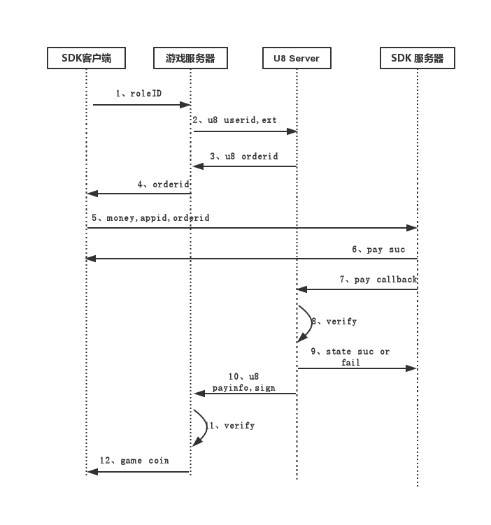

支付回调
==========

NOTE: 大部分渠道SDK支付都是异步通知的方式。注册游戏的时候，需要在渠道SDK后台配置一个支付通知地址，也有部分渠道SDK的支付通知地址，是在客户端调用渠道SDK支付接口的时候，通过参数传进去的。所有这些地址，都配置为U8Server中对应渠道SDK的支付回调处理接口的地址。


说明
----------

每个渠道SDK支付回调通知的参数和请求方式，都不太一样，所以，U8Server中，为每个渠道SDK都单独提供了一个支付回调处理接口。

对应的处理类在com.u8.server.web包名下，命名方式如下：

```
UCPayCallbackAction
BaiduPayCallbackAction
DownjoyPayCallbackAction
......
```

所有渠道SDK的支付通知地址，在配置的时候，格式都是固定的：{跟地址}/pay/渠道名/payCallback/渠道号

假设当前U8Server的跟地址是http://localhost:8080/

```
当前A游戏的UC渠道，对应的渠道号是 10；那么，A游戏中需要将UC的支付回调通知地址配置为：

http://localhost:8080/pay/uc/payCallback/10

当前B游戏的UC渠道，对应的渠道号是 50；那么，B游戏中需要将UC的支付回调通知地址配置为：

http://localhost:8080/pay/uc/payCallback/50

其他渠道，也是类似。

```

如果渠道SDK有管理后台，并且支付通知回调地址是在后台配置的。那么你直接配置对应渠道的地址即可。比如上面A游戏的UC渠道，你配置成
http://localhost:8080/pay/uc/payCallback/10 即可。

对于那些需要客户端通过参数传支付回调地址的渠道SDK，我们在客户端[获取订单号](u8server_order.md)的时候，将支付回调地址放在extension参数中，而不要将支付回调通知地址，写死在客户端。


流程
----------

收到渠道SDK的支付回调通知时，我们需要在对应的渠道SDK支付回调处理接口类中，按照渠道SDK的要求，做一些处理。我们先看看U8Server中，整个支付流程：


```
1、游戏客户端，首先请求游戏服务器要充值

2、游戏服务器拿着该用户的id和一些支付成功之后需要原样返回的数据，去访问U8 Server申请订单号

3、U8 Server生成一个唯一的订单号，同时数据库中生成一条订单记录，状态是正在支付状态

4、游戏服务器将订单号返回给客户端

5、游戏客户端，拿到订单号之后，带着订单号以及游戏里充值相关的数据，调用SDK抽象接口的支付接口，调用对应的SDK支付界面，进行充值操作。

6、当前SDK的渠道实现在调用SDK支付界面之前，需要把刚刚的订单号，放到渠道SDK支付参数的自定义参数中。这个每个渠道都是一样的。

7、渠道SDK支付成功，立马返回一个状态

8、同时，渠道SDK服务器会异步通知游戏开发商设置的支付回调地址。这里，就是上面我们提供的U8Server的该渠道的通知回调地址

9、U8Server收到充值回调，根据当前渠道SDK的要求，验证合法，并修改订单状态，立马给渠道SDK服务器返回一个成功或者失败的状态。

10、然后U8Server根据自定义参数中的orderID，查询到对应的订单信息，再根据订单信息，获取到当前用户信息和对应的游戏信息，然后调用接入游戏之前，游戏服务器提供给U8Server的支付回调地址。这个回调地址，游戏服务器只需要提供一个给U8Server就可以了。因为游戏服务器只和U8Server交互。

11、游戏服务器收到回调，验证成功与否，立马返回给U8Server一个成功或者失败的信息。同时，给对应的玩家加游戏币。

```

同时，我们通过登录认证的时序图，可以更加直观地看清整个流程：



通过这个流程，我们可以看到，所有渠道SDK支付头通知到U8Server，再由U8Server来通知到对应的游戏服务器。


渠道SDK支付回调
----------

NOTE: 如果你还没有搭建好U8Server的开发环境，建议你参考[这篇文档](u8server_setup.md)，先去搭建U8Server的开发环境。

假如你部署好了U8Server，并且根地址是http://localhost:8080/


由于各个渠道SDK支付回调通知的参数和请求方式都不同，所以我们为每个渠道SDK提供单独的回调处理接口。

各个渠道SDK支付回调处理接口对应的处理类在com.u8.server.web包名下，命名方式如下：

```
UCPayCallbackAction
BaiduPayCallbackAction
DownjoyPayCallbackAction
......
```

我们以百度渠道SDK为例：

```

@Controller
@Namespace("/pay/baidu")
public class BaiduPayCallbackAction extends UActionSupport{

    private int AppID;
    private String OrderSerial;
    private String CooperatorOrderSerial;
    private String Sign;
    private String Content;

    @Autowired
    private UOrderManager orderManager;

    @Action("payCallback")
    public void payCallback(){

        try{

            long orderID = Long.parseLong(CooperatorOrderSerial);

            UOrder order = orderManager.getOrder(orderID);

            int resultCode = 1;
            String resultMsg = "成功";

            if(order == null || order.getChannel() == null){
                Log.d("The order is null or the channel is null.");
                return;
            }

            if(order.getState() == PayState.STATE_COMPLETE){
                Log.d("The state of the order is complete. The state is "+order.getState());
                this.renderState(order.getChannel(), resultCode, resultMsg);
                return;
            }


            if (AppID == 0 || OrderSerial == null || CooperatorOrderSerial == null || Content == null || Sign == null){
                resultCode = 4;
                resultMsg="参数错误";
            }else{
                //appID验证
                if(!order.getChannel().getCpAppID().equals(AppID + "")){
                    resultCode= 2; //appid无效
                    resultMsg="AppID无效";
                }

                StringBuilder strSign = new StringBuilder();
                strSign.append(AppID);
                strSign.append(OrderSerial);
                strSign.append(CooperatorOrderSerial);
                strSign.append(Content);
                strSign.append(order.getChannel().getCpAppSecret());

                Log.e("The new sign is "+strSign.toString());
                //签名验证
                if(!EncryptUtils.md5(strSign.toString()).toLowerCase().equals(Sign.toLowerCase())){
                    resultCode= 3; //sign无效
                    resultMsg="Sign无效";
                }
            }

            if(resultCode == 1){
                String jsonStr= Base64.decode(Content);

                BaiduPayResult payResult = (BaiduPayResult) JsonUtils.decodeJson(jsonStr, BaiduPayResult.class);

                if(payResult != null && payResult.getOrderStatus() == 1){
                    order.setMoney((int)(payResult.getOrderMoney() * 100));
                    order.setChannelOrderID(OrderSerial);
                    order.setState(PayState.STATE_SUC);
                    orderManager.saveOrder(order);
                    SendAgent.sendCallbackToServer(this.orderManager, order);
                }else{
                    Log.e("The pay result decode2Bytes error. The content is "+jsonStr);
                }


            }else{
                order.setChannelOrderID(OrderSerial);
                order.setState(PayState.STATE_FAILED);
                orderManager.saveOrder(order);
            }

            renderState(order.getChannel(), resultCode, resultMsg);

        }catch (Exception e){
            e.printStackTrace();
        }

    }

    private void renderState(UChannel channel, int resultCode, String resultMsg) throws IOException {

        JSONObject json = new JSONObject();
        json.put("AppID", channel.getCpAppID());
        json.put("ResultCode", resultCode);
        json.put("ResultMsg", resultMsg);
        json.put("Sign", EncryptUtils.md5(channel.getCpAppID()+resultCode+channel.getCpAppSecret()));
        json.put("Content", "");

        Log.d("The result to sdk is "+json.toString());

        this.response.getWriter().write(json.toString());


    }

    public int getAppID() {
        return AppID;
    }

    public void setAppID(int appID) {
        AppID = appID;
    }

    public String getOrderSerial() {
        return OrderSerial;
    }

    public void setOrderSerial(String orderSerial) {
        OrderSerial = orderSerial;
    }

    public String getCooperatorOrderSerial() {
        return CooperatorOrderSerial;
    }

    public void setCooperatorOrderSerial(String cooperatorOrderSerial) {
        CooperatorOrderSerial = cooperatorOrderSerial;
    }

    public String getSign() {
        return Sign;
    }

    public void setSign(String sign) {
        Sign = sign;
    }

    public String getContent() {
        return Content;
    }

    public void setContent(String content) {
        Content = content;
    }
}

所有渠道SDK支付回调处理类的写法都是一样的。我们需要遵循一定的习惯或者规则：

1、Class的命名格式为:渠道名称+PayCallbackAction。比如百度渠道，叫BaiduPayCallbackAction
2、Class上使用两个注解：
	@Controller 				//这个固定，每个Action类都需要
	@Namespace("/pay/baidu")    //命名空间，这个格式也是固定的，/pay/渠道名称
3、根据渠道SDK的参数，定义对应的属性，每个属性，都需要有get,set方法
4、支付处理方法的注解必须为 : @Action("payCallback")

```

游戏服务器回调接口
----------

当U8Server收到渠道SDK支付回调，并处理成功时，我们需要里面调用游戏服的支付回调地址，通知游戏支付成功，让游戏服给玩家发游戏币。

```

请求地址：游戏服提供，配置在UGame表中payCallbackUrl字段中,也可以在下单的时候，在notifyUrl字段中传。如果下单的时候传了，优先使用下单中传的回调地址。
请求方式：POST
请求参数(JSON格式)：
	{
		state:状态，1：成功;其他失败
		data:{
			productID：商品ID
			orderID: 订单号
			userID: 用户ID
			channelID: 渠道ID
			gameID: 游戏ID
			serverID：游戏服务器ID
			money:充值金额，单位分
			currency：货币类型，默认RMB
			extension：获取订单号服务器传过来的自定义参数，原样返回

            signType：签名类型，目前支持md5和rsa，可以自己设定。 该字段不参与签名
            sign：签名值。 该字段不参与签名
		}
	}

返回：

游戏服处理成功，直接返回一个"SUCCESS"字符串到U8Server即可。失败，返回一个"FAIL"字符串。

```

游戏服务器sign验证规则：

首先对收到的data中的数据进行解析， 解析出来之后，除了signType和sign两个字段外， 其他所有的字段按照字母排列顺序进行组合,格式如下：

signStr = "channelID=5&currency=RMB&.....&userID=4344"

组合字符串最后，加上u8server为该游戏分配的SecretKey。 

signStr +=  "&" + SecretKey

这样得到的signStr，就是待校验的数据字符串了。

**如果signType=="md5"，那么就直接这样验证：**

String localSign = md5(signStr)
if(localSign == sign) return true;
else return false;

将本地生成的md5和收到的sign进行比对。 一致，则验证通过。  这里md5字符串为 32位小写

**如果signType=="rsa"，则验证方法如下：**

RSAUtils.verify(signStr, publicKey, "UTF-8");

RSAUtils类可以从U8Server代码中获取， publicKey是u8server为该游戏分配的支付公钥。


U8Server生成sign的代码，在com.u8.server.web.SendAgent类中，方法如下：

```
    private static String generateSign(UOrder order, String signType){

        StringBuilder sb = new StringBuilder();
        sb.append("channelID=").append(order.getChannelID()).append("&")
                .append("currency=").append(order.getCurrency()).append("&")
                .append("extension=").append(order.getExtension()).append("&")
                .append("gameID=").append(order.getGame().getAppID()).append("&")
                .append("money=").append(order.getMoney()).append("&")
                .append("orderID=").append(order.getOrderID()).append("&")
                .append("productID=").append(order.getProductID()).append("&")
                .append("serverID=").append(order.getServerID()).append("&")
                .append("userID=").append(order.getUserID()).append("&")
                .append(order.getGame().getAppSecret());

        if("md5".equalsIgnoreCase(signType)){
            return EncryptUtils.md5(sb.toString()).toLowerCase();
        }else{
            return RSAUtils.sign(sb.toString(), order.getGame().getAppRSAPriKey(), "UTF-8");
        }

    }
```


